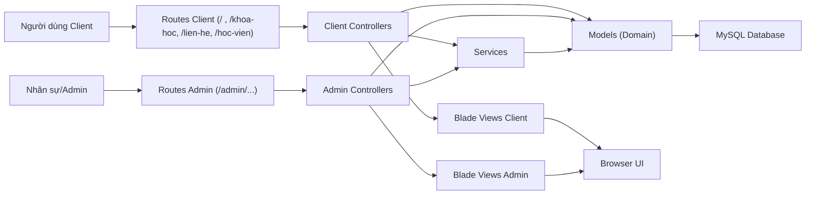

# DACNCNPM - Hệ Thống Quản Lý Trung Tâm Ngoại Ngữ (Bản Tiếng Việt)

[](https://laravel.com)
[](https://www.php.net/)
[](https://www.mysql.com/)
[](https://opensource.org/licenses/MIT)

Monolith Laravel phục vụ quản lý vận hành trung tâm ngoại ngữ: khóa học, lớp học, học viên, giáo viên, tài chính, bài viết, thông báo và liên hệ khách hàng.

## Mục lục
- [1. Tổng quan](#1-tổng-quan)
- [2. Sơ đồ luồng hệ thống](#2-sơ-đồ-luồng-hệ-thống)
- [3. Tính năng chính](#3-tính-năng-chính)
- [4. Công nghệ sử dụng](#4-công-nghệ-sử-dụng)
- [5. Cấu trúc dự án](#5-cấu-trúc-dự-án)
- [6. Upload ảnh dùng chung](#6-upload-ảnh-dùng-chung)
- [7. Cài đặt môi trường local](#7-cài-đặt-môi-trường-local)
- [8. Chạy dự án](#8-chạy-dự-án)
- [9. Biến môi trường quan trọng](#9-biến-môi-trường-quan-trọng)
- [10. Mô hình học phí hiện tại](#10-mô-hình-học-phí-hiện-tại)
- [11. Lệnh hữu ích](#11-lệnh-hữu-ích)
- [12. Test và chất lượng mã nguồn](#12-test-và-chất-lượng-mã-nguồn)
- [13. Lưu ý dữ liệu và migration](#13-lưu-ý-dữ-liệu-và-migration)
- [14. Tài liệu Auth và Nhân sự](#14-tài-liệu-auth-và-nhân-sự)
- [15. Quy trình phát triển](#15-quy-trình-phát-triển)
- [16. Hỗ trợ](#16-hỗ-trợ)

## 1. Tổng quan
- Ngành: Hệ thống thông tin quản lý trung tâm ngoại ngữ.
- Kiến trúc: Laravel + Blade + MySQL.
- Đối tượng sử dụng:
  - Khách/người học: xem khóa học, đăng ký tư vấn, theo dõi thông tin cá nhân.
  - Nhân sự/Admin: vận hành đào tạo, tài chính, nội dung, thông báo, liên hệ.
- Route chính:
  - `web client`: `/`
  - `đăng nhập học viên`: `/login`
  - `đăng nhập giảng viên`: `/teacher/login`
  - `đăng nhập nhân viên/admin`: `/staff/login`
  - `khu nội bộ`: `/admin` (yêu cầu đăng nhập + middleware staff)

## 2. Sơ đồ luồng hệ thống


## 3. Tính năng chính
### Client
- Trang chủ, giới thiệu, blog, danh sách/chi tiết khóa học.
- Đăng ký lớp học và checkout.
- Trang liên hệ, form đăng ký tư vấn.
- Khu vực học viên: profile, đổi mật khẩu, lịch học, lớp học, hóa đơn.
- Auth học viên: đăng ký, xác thực email, quên/đặt lại mật khẩu, đăng nhập Google, reCAPTCHA, ghi nhớ đăng nhập.
- Thông báo realtime cho học viên (dropdown + stream API).

### Admin
- Dashboard thống kê tổng quan.
- Quản lý học viên, giáo viên, nhân viên.
- Hồ sơ nhân sự chi tiết, bàn giao tài khoản, tài liệu nhân sự private.
- Quản lý đào tạo: danh mục khóa học, khóa học, lớp học, buổi học, ca học, chính sách giá lớp.
- Quản lý tài chính: hóa đơn, phiếu thu, cập nhật trạng thái.
- Gói lương nhân sự và tài liệu handoff payroll/Figma.
- Quản lý nội dung: bài viết, danh mục bài viết, tag.
- Quản lý thông báo nội bộ.
- Quản lý liên hệ/lead (có hỗ trợ thùng rác và thao tác loạt).
- Cấu hình cơ sở đào tạo, phòng học, địa chỉ theo tỉnh/phường.
- Upload ảnh dùng chung cho avatar học viên, bài viết và khóa học.
- Cổng nội bộ tách theo portal:
  - `/teacher/login` cho giảng viên
  - `/staff/login` cho nhân viên và admin

## 4. Công nghệ sử dụng
- Backend: Laravel 12, PHP 8.3+
- Frontend: Blade, Bootstrap 5, JavaScript, Vite
- Database: MySQL 8.x
- Cache/Redis client: Predis 3.x
- Build tool: Vite
- Test: PHPUnit (Laravel test runner)

## 5. Cấu trúc dự án
```text
app/
  Http/Controllers/
    Client/        # Controller cho giao diện người học
    Admin/         # Controller khu vực quản trị
  Models/          # Domain model theo nhóm: Auth, Course, Education, Finance...
  Services/        # DashboardService, ThongBaoService...
resources/views/
  clients/         # View client
  admin/           # View admin
  components/      # Blade components, gồm cả x-upload.image
resources/js/components/
  image-upload.js  # Logic upload ảnh dùng chung (preview, drag-drop, progress)
app/Services/Support/Uploads/
  ImageUploadService.php   # Backend upload ảnh dùng chung
routes/
  web.php          # Toàn bộ route web + admin
database/
  migrations/      # Migration
  seeders/         # Seeder
public/assets/     # Static assets css/js/image
```

## 6. Upload ảnh dùng chung
- Backend dùng `ImageUploadService` + preset trong `config/uploads.php`.
- API upload ảnh dùng chung: `POST /api/uploads/images`.
- Blade component dùng chung: `x-upload.image`.
- Có 2 chế độ:
  - `instant`: upload AJAX ngay, dùng cho avatar học viên.
  - `deferred`: chỉ preview/chọn file, gửi kèm form cha khi submit, dùng cho bài viết và khóa học.
- Đã áp dụng sẵn tại:
  - `clients/hoc-vien/profile/index.blade.php`
  - `admin/bai-viet/create.blade.php`
  - `admin/bai-viet/edit.blade.php`
  - `admin/khoa-hoc/create.blade.php`
  - `admin/khoa-hoc/edit.blade.php`

## 7. Cài đặt môi trường local
### 7.1 Yêu cầu
- PHP 8.3+
- Composer 2+
- Node.js 18+ và npm
- MySQL 8.x
- Redis 7+ nếu muốn bật cache Redis cho các chức năng realtime

### 7.2 Clone và cài đặt
```bash
git clone <repo-url>
cd DACNCNPM_TrungTamNN
composer install
npm install
cp .env.example .env
php artisan key:generate
```

Lưu ý môi trường:
- Dependency hiện tại yêu cầu runtime PHP `>= 8.3`.
- Nếu máy đang có cả XAMPP PHP 8.2 và Homebrew PHP 8.5, hãy dùng `php`, `composer`, `artisan` theo PHP Homebrew để chạy local.
- XAMPP vẫn có thể dùng cho MySQL/Apache nếu phiên bản PHP đi kèm đã được nâng lên phù hợp; nếu không, nên chạy app bằng `php artisan serve`.

### 7.3 Cấu hình `.env` (MySQL)
```env
APP_NAME="DACNCNPM TrungTamNN"
APP_ENV=local
APP_DEBUG=true
APP_URL=http://127.0.0.1:8000

DB_CONNECTION=mysql
DB_HOST=127.0.0.1
DB_PORT=3306
DB_DATABASE=dacncnpm_trungtamnn
DB_USERNAME=root
DB_PASSWORD=

REDIS_CLIENT=predis
REDIS_HOST=127.0.0.1
REDIS_PORT=6379
REDIS_PASSWORD=null
REDIS_DB=0
REDIS_CACHE_DB=1
RATE_LIMITER_STORE=redis
PUBLIC_LIST_CACHE_STORE=redis
PUBLIC_LIST_CACHE_TTL=300
AUTH_LOGIN_RATE_LIMIT_PER_MINUTE=12
AUTH_LOGIN_RATE_LIMIT_IP_PER_MINUTE=30
AUTH_REGISTER_RATE_LIMIT_PER_MINUTE=6
AUTH_REGISTER_RATE_LIMIT_IP_PER_MINUTE=12
AUTH_EMAIL_CHECK_RATE_LIMIT_PER_MINUTE=30
AUTH_EMAIL_CHECK_RATE_LIMIT_IP_PER_MINUTE=120
REGISTER_EMAIL_CHECK_CACHE_STORE=redis
REGISTER_EMAIL_CHECK_CACHE_TTL=60
```

Nếu bật Redis local:
```bash
brew tap redis/redis
brew install --cask redis
redis-server /opt/homebrew/etc/redis.conf
redis-cli PING
```

Nếu Redis trả `PONG`, cài client PHP cho Laravel:
```bash
composer require predis/predis
php artisan optimize:clear
```

Nếu máy local cần chạy mail queue, gửi thông báo hàng loạt hoặc export nền bằng Redis:
```env
QUEUE_CONNECTION=redis
REDIS_QUEUE_CONNECTION=default
REDIS_QUEUE=default
```

Worker Redis của project hiện cần nghe các queue:
- `notifications` cho gửi thông báo hàng loạt
- `exports` cho export Excel/PDF
- `maintenance` cho batch job hóa đơn quá hạn và hủy giữ chỗ quá hạn

## 8. Chạy dự án
### Cách 1: Chạy đồng thời server + queue + vite (khuyến nghị)
```bash
composer dev
```

### Cách 2: Tự chạy từng tiến trình
```bash
php artisan serve
composer queue:redis
npm run dev
```

### Cách 3: Build static assets cho production
```bash
npm run build
```

Nếu dùng XAMPP/Apache:
- Đặt project trong `htdocs`.
- Truy cập qua virtual host hoặc `/public` theo cấu hình Apache.
- Chỉ dùng XAMPP để chạy web khi PHP của XAMPP đạt `>= 8.3`; nếu XAMPP còn PHP 8.2 thì `artisan` và ứng dụng sẽ bị chặn bởi Composer platform check.

## 9. Biến môi trường quan trọng
- `APP_URL`: URL gốc ứng dụng.
- `DB_*`: kết nối CSDL.
- `QUEUE_CONNECTION`: nên để `redis` nếu máy local cần chạy mail queue, gửi thông báo hàng loạt hoặc export nền.
- `REDIS_*`: cấu hình kết nối Redis.
- `RATE_LIMITER_STORE`: cache store dùng cho Laravel rate limiter, mặc định `redis`.
- `PUBLIC_LIST_CACHE_STORE`: store dùng cho cache danh sách public như khóa học/blog/footer.
- `PUBLIC_LIST_CACHE_TTL`: thời gian cache danh sách public, mặc định 300 giây.
- `AUTH_LOGIN_RATE_LIMIT_*`: ngưỡng chặn spam cho login theo tài khoản/IP.
- `AUTH_REGISTER_RATE_LIMIT_*`: ngưỡng chặn spam cho submit đăng ký.
- `AUTH_EMAIL_CHECK_RATE_LIMIT_*`: ngưỡng chặn spam cho kiểm tra email realtime.
- `REGISTER_EMAIL_CHECK_CACHE_STORE`: store dùng cho cache kiểm tra email realtime.
- `REGISTER_EMAIL_CHECK_CACHE_TTL`: thời gian cache kết quả check email, mặc định 60 giây.
- `MAIL_*`: cấu hình gửi mail.
- `GOOGLE_CLIENT_ID`, `GOOGLE_CLIENT_SECRET`: đăng nhập Google cho học viên.
- `RECAPTCHA_*`: reCAPTCHA v3 cho login/register/quên mật khẩu public.
- `GEMINI_API_KEY`, `GEMINI_MODEL`: khóa/mode AI (nếu kích hoạt tính năng liên quan).

## 10. Mô hình học phí hiện tại
- Học phí được quản lý ở cấp `lớp học`, không còn ở cấp `khóa học`.
- `Khóa học` chỉ mô tả chương trình đào tạo; giá bán và cách thu tiền nằm ở `lophoc_chinhsachgia`.
- `Lớp học` có thể được tạo trước khi nhập học phí, nhưng phải có chính sách giá hợp lệ trước khi chuyển sang trạng thái tuyển sinh hoặc đang học.
- `ngày kết thúc` của lớp không nhập tay trong flow mới; hệ thống đồng bộ theo buổi học cuối cùng.
- Khi học viên đăng ký, hệ thống chụp `snapshot` học phí vào `dangkylophoc` để không bị ảnh hưởng khi lớp thay đổi giá sau này.
- Hệ thống hiện chỉ hỗ trợ `một lần` hoặc `theo đợt`; `theo tháng` đã bị loại khỏi runtime mới.
- `lophoc_dotthu` dùng để lưu kế hoạch thu theo đợt; runtime hiện tại đã sinh nhiều hóa đơn học phí khi lớp cấu hình thu theo đợt.
- Đăng ký `Chờ thanh toán` có `ngày hết hạn giữ chỗ`; job hệ thống sẽ tự hủy giữ chỗ quá hạn nếu chưa phát sinh thu tiền.
- Hóa đơn quá hạn khi lớp đang học sẽ được job hệ thống xử lý để chuyển đăng ký sang trạng thái nợ học phí.
- Hồ sơ giáo viên và nhân viên hiện có luồng create/edit/show hoàn chỉnh, xuất PDF hồ sơ và phiếu bàn giao tài khoản.
- Hướng dẫn vận hành tổng hợp: `docs/05-huong-dan/huong-dan.md`.
- Hướng dẫn chi tiết:
  - `docs/05-huong-dan/hoc-phi-lop-hoc.md`
  - `docs/05-huong-dan/dang-ky-thanh-toan-va-phieu-thu.md`
  - `docs/05-huong-dan/nhan-su-ho-so-va-ban-giao-tai-khoan.md`
  - `docs/05-huong-dan/luong-nhan-su-va-payroll.md`

## 11. Lệnh hữu ích
```bash
# Chạy test
php artisan test

# Clear cache
php artisan optimize:clear

# Kiểm tra Redis
redis-cli PING
php artisan tinker

# Chạy worker Redis cho mail/thông báo/export
composer queue:redis

# Tạo symlink storage
php artisan storage:link

# Kiểm tra hóa đơn quá hạn (thủ công)
php artisan invoice:check-overdue
php artisan invoice:check-overdue --dry-run

# Kiểm tra và hủy giữ chỗ quá hạn (thủ công)
php artisan registration:expire-holds
php artisan registration:expire-holds --dry-run
```

Trong `tinker` có thể kiểm tra nhanh:
```php
Cache::store('redis')->put('redis_test', 'ok', 60);
Cache::store('redis')->get('redis_test');
```

### Redis đang làm gì trong project
- Cache kết quả `GET /register/check-email` để giảm query MySQL lặp lại khi người dùng gõ email đăng ký.
- Làm store cho Laravel rate limiter của `login`, `register` và `check-email`.
- Cache các danh sách public đọc nhiều:
  - `/khoa-hoc`
  - danh sách lớp public trong `/khoa-hoc/{slug}`
  - `/blog`
  - block public ở trang chủ
  - footer và `register-advice`
- Chạy queue cho:
  - mail auth
  - gửi thông báo hàng loạt
  - export Excel/PDF
  - batch `invoice:check-overdue`
  - batch `registration:expire-holds`
- Chat typing/presence hiện dùng Laravel `Cache`; phần này chỉ chạy trên Redis nếu bạn cấu hình store cache phù hợp cho chat.

Muốn quan sát cache public bằng Redis:
```bash
redis-cli MONITOR
```

Sau đó mở một trong các trang:
- `/khoa-hoc`
- `/blog`
- `/`

Hoặc scan key:
```bash
redis-cli --scan --pattern '*public-content*'
```

Muốn quan sát Redis đang được hit khi nhập email ở form đăng ký:
```bash
redis-cli MONITOR
```

Sau đó mở `/register` và nhập email. Bạn sẽ thấy key dạng `auth:register:email-check:<sha1>` được `GET`/`SETEX`.

Muốn quan sát rate limit Redis của Auth:
- nhập login quá nhanh hoặc gọi lặp `/register/check-email`
- trên `redis-cli MONITOR` bạn sẽ thấy các key limiter được đọc/ghi trước khi request vào sâu controller
- các route này hiện có limiter riêng:
  - `auth-login`
  - `auth-register`
  - `auth-email-check`

Sau khi `git pull` code mới từ team, nên chạy lại tối thiểu:
```bash
composer install
npm install
php artisan optimize:clear
php artisan migrate
```

Nếu pull có thay đổi `.env.example`, hãy cập nhật `.env` thủ công trước khi chạy app.

Nếu máy đó dùng Redis local, chạy thêm:
```bash
redis-cli PING
composer queue:redis
```

## 12. Test và chất lượng mã nguồn
```bash
# Test full
composer test

# Format code (Laravel Pint)
./vendor/bin/pint
```

Thư mục test hiện có:
- `tests/Feature`
- `tests/Unit`

## 13. Lưu ý dữ liệu và migration
- Dự án hiện có nhiều bảng domain custom (`taikhoan`, `lienhe`, `hoadon`, ...).
- Thư mục migration trong repo chủ yếu là migration bổ sung/cập nhật.
- Nếu khởi tạo mới trên máy sạch, cần đảm bảo đã có schema nền từ team (hoặc bộ migration đầy đủ) trước khi chạy dự án toàn phần.
- Migration `2026_03_14_150000_refactor_class_pricing_to_lophoc_chinhsachgia.php` chuyển học phí từ mô hình cũ (`hocphi`, `lophoc.hocPhiId`) sang mô hình mới theo lớp học.
- Migration `2026_03_15_200000` -> `2026_03_15_200400` bổ sung hồ sơ nhân sự, gói lương, tài liệu nhân sự và backfill dữ liệu cũ.

Lưu ý import dump SQL:

- Không nên phục hồi dữ liệu bằng cách tắt `FOREIGN_KEY_CHECKS` rồi bỏ qua orphan record.
- Các bảng như `lophoc`, `lophoc_chinhsachgia`, `buoihoc`, `chat_rooms` phải đồng bộ khóa ngoại trước khi thêm constraint.
- Nếu gặp lỗi `#1452`, cần soát lại file dump để đảm bảo bản ghi cha tồn tại trước bản ghi con.

Lệnh migrate cơ bản:
```bash
php artisan migrate
```

## 14. Tài liệu Auth và Nhân sự
- Portal đăng nhập hiện tại:
  - Học viên: `/login`
  - Giảng viên: `/teacher/login`
  - Nhân viên/Admin: `/staff/login`
- Giao diện login sử dụng dock chuyển portal cố định ở đáy màn hình để đổi nhanh giữa các cổng đăng nhập.
- Trong cùng một trình duyệt, hệ thống chỉ nên được sử dụng với 1 portal đăng nhập tại một thời điểm. Nếu cần test song song admin và học viên, hãy dùng trình duyệt khác hoặc cửa sổ ẩn danh.
- Tổng quan module Auth: `docs/05-huong-dan/auth.md`
- Kiến trúc và quyết định: `docs/01-phan-tich/auth-kien-truc-va-quyet-dinh.md`
- Cấu hình và triển khai: `docs/05-huong-dan/auth-cau-hinh-va-trien-khai.md`
- Vận hành và kiểm thử: `docs/05-huong-dan/auth-van-hanh-va-kiem-thu.md`
- Joi validation phía client: `docs/05-huong-dan/auth-joi-validation.md`
- Hồ sơ nhân sự, bàn giao tài khoản, CV, PDF: `docs/05-huong-dan/nhan-su-ho-so-va-ban-giao-tai-khoan.md`
- Lương nhân sự và payroll: `docs/05-huong-dan/luong-nhan-su-va-payroll.md`
- Figma handoff payroll: `docs/05-huong-dan/figma-luong-handoff.md`
- Thay đổi theo mốc: `CHANGELOG.md`

## 15. Quy trình phát triển
- Không push trực tiếp vào `main`.
- Tạo branch theo chức năng, mở Pull Request để review.
- Viết commit message rõ ràng theo mục đích:
  - `feat:` thêm tính năng
  - `fix:` sửa lỗi
  - `refactor:` tái cấu trúc
  - `docs:` cập nhật tài liệu
  - `chore:` việc hệ thống/cấu hình

## 16. Hỗ trợ
- Nếu gặp lỗi khi setup, tạo issue trong repository và kèm:
  - log lỗi
  - bước tái hiện
  - môi trường (OS, PHP, Node, MySQL)

---

Tài liệu này ưu tiên cho onboarding thành viên mới và demo nghiệp vụ với stakeholder.
