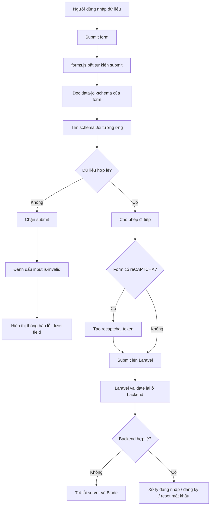
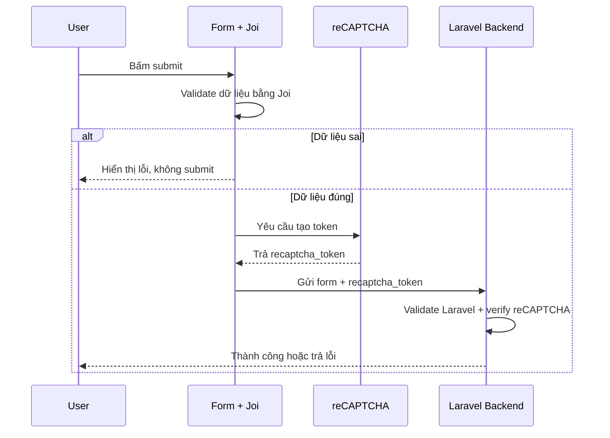

# Auth - Luồng Hoạt Động Joi

> Cập nhật: 2026-03-12

Tài liệu này giải thích cách `Joi` đang được dùng trong dự án để xác thực dữ liệu đầu vào ở phía trình duyệt cho các form Auth.

## 1. Joi là gì trong dự án này

`Joi` là thư viện JavaScript dùng để kiểm tra dữ liệu trước khi form submit lên server.

Trong dự án này, `Joi` được dùng để:
- chặn submit sớm nếu người dùng nhập thiếu hoặc sai định dạng
- hiển thị lỗi ngay trên form
- giảm request không cần thiết lên backend
- phối hợp với reCAPTCHA để chỉ tạo token khi form hợp lệ

Quan trọng:
- `Joi` không thay thế validate của Laravel
- backend Laravel vẫn là lớp xác thực bắt buộc cuối cùng

Nói ngắn gọn:
- `Joi` = lớp kiểm tra nhanh ở frontend
- Laravel validation = lớp kiểm tra bắt buộc ở backend

## 2. Phạm vi hiện tại

Hiện `Joi` đã áp dụng cho các form sau:

- đăng nhập học viên `/login`
- đăng nhập giảng viên `/teacher/login`
- đăng nhập nhân viên `/staff/login`
- đăng ký học viên `/register`
- quên mật khẩu `/password/email`
- đặt lại mật khẩu `/password/reset`
- đổi mật khẩu bắt buộc
- đổi mật khẩu trong khu học viên

## 3. Các file chính

### File trung tâm

- `resources/js/validation/forms.js`

Đây là nơi:
- khai báo schema `Joi`
- đọc dữ liệu form
- chạy validate
- hiển thị lỗi ra giao diện

### File nạp module

- `resources/js/app.js`

File này import:

```js
import './validation/forms';
```

### Layout nạp bundle

- `resources/views/layouts/auth.blade.php`
- `resources/views/layouts/client.blade.php`

Hai layout này nạp asset Vite:

```blade
@vite(['resources/js/app.js'])
```

### Các form đang dùng schema

- `resources/views/auth/login.blade.php`
- `resources/views/auth/register.blade.php`
- `resources/views/auth/passwords/email.blade.php`
- `resources/views/auth/passwords/reset.blade.php`
- `resources/views/auth/force-change-password.blade.php`
- `resources/views/clients/hoc-vien/change-password.blade.php`

## 4. Cách một form được nối với Joi

Mỗi form được gắn một attribute:

```html
data-joi-schema="login"
```

Ví dụ:

```blade
<form id="loginform" data-joi-schema="login" ...>
```

Tên schema này phải khớp với key trong `resources/js/validation/forms.js`.

Ví dụ trong code:

```js
const schemas = {
    login: Joi.object({
        taiKhoan: Joi.string().trim().required(),
        password: Joi.string().min(8).required(),
    }),
};
```

## 5. Luồng hoạt động tổng thể



## 6. Luồng chi tiết theo thứ tự chạy

### Bước 1: Trang load xong

Khi DOM load xong, `forms.js` chạy:

```js
document.addEventListener('DOMContentLoaded', () => {
    document.querySelectorAll('form[data-joi-schema]').forEach(bindForm);
});
```

Ý nghĩa:
- quét tất cả form có `data-joi-schema`
- gắn listener `submit` cho từng form

### Bước 2: Người dùng bấm submit

Khi submit:
- script lấy tên schema từ `data-joi-schema`
- lấy toàn bộ dữ liệu từ `FormData`
- chuẩn hóa dữ liệu trước khi kiểm tra

Hàm đang dùng:
- `getSchema(form)`
- `normalizeFormData(form)`
- `validateForm(form)`

### Bước 3: Joi validate dữ liệu

Ví dụ với form đăng ký:
- `name` phải có
- `email` phải đúng định dạng
- `password` tối thiểu 8 ký tự
- `password_confirmation` phải khớp `password`

Nếu lỗi:
- `event.preventDefault()`
- không submit
- không gọi tiếp reCAPTCHA

### Bước 4: Hiển thị lỗi

Khi `Joi` trả về `error.details`, hệ thống:
- xóa lỗi cũ
- thêm class `is-invalid` vào input
- thêm `<div class="invalid-feedback ...">` sau field

Các hàm liên quan:
- `clearErrors(form)`
- `showFieldError(form, fieldName, message)`

### Bước 5: Nếu hợp lệ thì mới submit

Nếu `Joi` pass:
- dữ liệu trim/normalize được ghi lại vào input nếu cần
- form được phép đi tiếp

### Bước 6: Nếu có reCAPTCHA thì reCAPTCHA chạy sau Joi

Ở các form public có reCAPTCHA, partial:

- `resources/views/auth/partials/recaptcha-script.blade.php`

đã được sửa để kiểm tra:

```js
if (window.FiveGeniusValidation && !window.FiveGeniusValidation.validateForm(form)) {
    event.preventDefault();
    event.stopPropagation();
    return;
}
```

Ý nghĩa:
- form phải qua `Joi` trước
- chỉ khi hợp lệ mới gọi `grecaptcha.execute(...)`

Điểm này quan trọng vì:
- tránh tạo token reCAPTCHA vô ích
- tránh submit form sai nhưng vẫn tốn bước xác minh

### Bước 7: Laravel validate lại ở backend

Sau khi frontend pass:
- request vẫn được gửi lên server
- controller Laravel vẫn dùng `$request->validate(...)` hoặc `Validator::make(...)`

Lý do phải giữ backend validation:
- frontend có thể bị bypass
- người dùng có thể gửi request trực tiếp bằng Postman/cURL
- bảo mật không được phụ thuộc vào JavaScript

## 7. Các schema hiện có

Trong `resources/js/validation/forms.js`, các schema đang có:

- `login`
- `register`
- `forgotPassword`
- `resetPassword`
- `forceChangePassword`
- `studentChangePassword`

### 7.1 Login

Kiểm tra:
- `taiKhoan` bắt buộc
- `password` bắt buộc, tối thiểu 8 ký tự

### 7.2 Register

Kiểm tra:
- `name` bắt buộc
- `email` đúng định dạng
- `password` tối thiểu 8 ký tự
- `password_confirmation` phải khớp `password`

### 7.3 Forgot Password

Kiểm tra:
- `email` bắt buộc
- đúng định dạng email

### 7.4 Reset Password

Kiểm tra:
- `email`
- `password`
- `password_confirmation`

### 7.5 Force Change Password

Kiểm tra:
- `new_password`
- `new_password_confirmation`

### 7.6 Student Change Password

Kiểm tra:
- `current_password`
- `new_password`
- `new_password_confirmation`

## 8. Dòng chảy riêng giữa Joi và reCAPTCHA

Đây là luồng quan trọng nhất với form public:



## 9. Vì sao không chuyển toàn bộ validate backend sang Joi

Đây là điểm dễ hiểu nhầm nhất.

Không nên “chuyển hết sang Joi” theo nghĩa bỏ validate Laravel, vì:

- `Joi` chạy ở trình duyệt, có thể bị tắt hoặc bypass
- backend Laravel mới là nơi quyết định dữ liệu có hợp lệ thật hay không
- nhiều rule backend liên quan database:
  - `unique`
  - `exists`
  - quyền truy cập
  - trạng thái tài khoản
  - logic nghiệp vụ

Vì vậy cách triển khai đúng là:
- frontend dùng `Joi`
- backend vẫn giữ validate Laravel

Đây là mô hình phòng thủ 2 lớp.

## 10. Cách thêm Joi cho một form mới

Ví dụ bạn muốn thêm `Joi` cho một form mới.

### Bước 1: Thêm schema vào `forms.js`

```js
newForm: Joi.object({
    title: Joi.string().trim().required().messages({
        'string.empty': 'Vui lòng nhập tiêu đề.',
    }),
}),
```

### Bước 2: Gắn `data-joi-schema` vào form

```blade
<form data-joi-schema="newForm" ...>
```

### Bước 3: Build lại asset

```bash
npm run build
```

Hoặc khi dev:

```bash
npm run dev
```

### Bước 4: Giữ validation backend

Trong controller Laravel vẫn phải có validate tương ứng.

## 11. Cách debug khi Joi không chạy

Kiểm tra theo thứ tự:

1. `node_modules` đã có `joi` chưa
2. đã chạy `npm install` chưa
3. đã chạy `npm run build` hoặc `npm run dev` chưa
4. layout có `@vite(['resources/js/app.js'])` chưa
5. form có `data-joi-schema="..."` không
6. tên schema có khớp key trong `forms.js` không
7. mở DevTools Console xem có lỗi JS không

## 12. Cách debug khi Joi chạy nhưng không hiện lỗi đúng chỗ

Kiểm tra:

1. input có đúng `name=""` như trong schema không
2. field có nằm trong `.password_box` hay layout đặc biệt không
3. lỗi có bị CSS khác ghi đè không
4. script cũ của form có đang `preventDefault` hoặc sửa DOM không

## 13. Cách debug khi Joi pass nhưng backend vẫn báo lỗi

Điều này là bình thường trong nhiều trường hợp.

Ví dụ:
- email đúng định dạng nhưng đã tồn tại
- tài khoản hợp lệ về cú pháp nhưng sai nghiệp vụ
- token reCAPTCHA hết hạn
- dữ liệu bị sửa từ ngoài frontend

Khi đó cần kiểm tra:
- controller Laravel
- rule backend
- log ứng dụng

## 14. Tóm tắt dễ nhớ

Luồng ngắn gọn:

1. User bấm submit
2. `Joi` kiểm tra trước ở frontend
3. Nếu sai thì chặn luôn và hiện lỗi
4. Nếu đúng thì mới cho reCAPTCHA chạy
5. Sau đó request mới lên Laravel
6. Laravel kiểm tra lại lần cuối

Công thức nhớ:

- `Joi` giúp UX nhanh hơn
- Laravel giữ an toàn dữ liệu
- reCAPTCHA chỉ chạy sau khi form hợp lệ

## 15. Tài liệu liên quan

- `docs/05-huong-dan/auth.md`
- `docs/05-huong-dan/auth-cau-hinh-va-trien-khai.md`
- `docs/05-huong-dan/auth-van-hanh-va-kiem-thu.md`
- `CHANGELOG.md`
