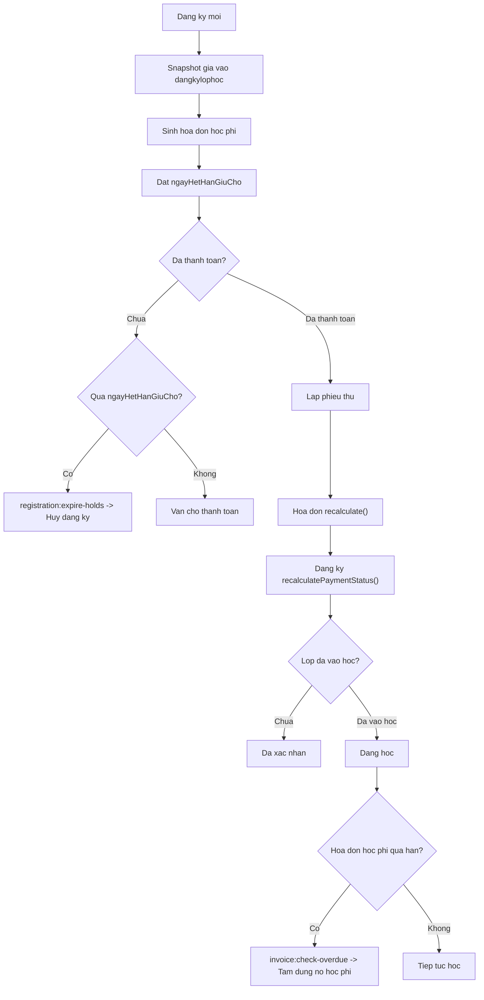

# 05B - Quy trinh dang ky, thanh toan, hoa don va phieu thu

## 1. Muc tieu tai lieu

Tai lieu nay mo ta quy trinh nghiep vu tu luc tao dang ky den luc:

- sinh cong no
- ghi nhan thanh toan
- cap nhat trang thai dang ky
- xu ly qua han giu cho
- xu ly qua han hoc phi khi lop dang hoc

## 2. Tu khoa chinh

- `Dang ky hoc`: ban ghi trong `dangkylophoc`
- `Hoa don`: cong no phai thu trong `hoadon`
- `Phieu thu`: giao dich thu tien thuc te trong `phieuthu`
- `Giữ chỗ`: kha nang chiem cho trong lop khi dang ky o trang thai `Cho thanh toan`

## 3. Luong nghiep vu chi tiet

### 3.1 Tao dang ky

Diem vao:

- Hoc vien dang ky tren website
- Nhan su tao dang ky tai quay

He thong se:

1. Kiem tra lop dang `Dang tuyen sinh`
2. Kiem tra chinh sach gia hop le
3. Kiem tra si so
4. Kiem tra trung lich
5. Kiem tra hoc vien chua co dang ky hieu luc o lop do
6. Tao snapshot gia
7. Tao hoa don hoc phi
8. Tao hoa don phu phi mac dinh neu co
9. Dat `ngayHetHanGiuCho`

### 3.2 Cho thanh toan

Khi dang ky vua duoc tao:

- Trang thai = `Cho thanh toan`
- Dang ky dang chiem cho
- Co the co 1 hoa don tong hoac nhieu hoa don hoc phi theo dot

### 3.3 Ghi nhan phieu thu

Khi trung tam thu tien:

1. Nhan su tao `phieuthu`
2. `phieuthu.taiKhoanId` = hoc vien nop tien
3. `phieuthu.nguoiDuyetId` = nhan su thu tien
4. He thong goi `HoaDon::recalculate()`
5. He thong tiep tuc goi `DangKyLopHoc::recalculatePaymentStatus()`

Ket qua:

- Hoa don cap nhat `daTra`
- Hoa don cap nhat `trangThai`
- Dang ky cap nhat lai trang thai

Tac vu van hanh moi:

- Ngay sau khi lap phiếu thu, admin co the chon `Luu va in phiếu thu`
- O trang chi tiet hoa don, moi phiếu thu hop le deu co the:
  - in lai
  - gui email file PDF cho hoc vien / phu huynh
- Danh sach phiếu thu o cong hoc vien cung cho phep chon tung phiếu de in hoac gui email

### 3.3.1 Xuat va gui tai lieu tai chinh

He thong ho tro 2 loai tai lieu:

- `Phieu thu`
- `Hoa don`

Tai admin:

- `GET /admin/hoa-don/{id}/in`: mo ban in hoa don
- `POST /admin/hoa-don/{id}/gui-email`: gui email hoa don dinh kem file PDF
- `GET /admin/hoa-don/phieu-thu/{id}/in`: mo ban in phieu thu
- `POST /admin/hoa-don/phieu-thu/{id}/gui-email`: gui email phieu thu

Tai cong hoc vien:

- `GET /hoc-vien/hoa-don/{id}/in`
- `POST /hoc-vien/hoa-don/{id}/gui-email`
- `GET /hoc-vien/hoc-phi/phieu-thu/{id}/in`
- `POST /hoc-vien/hoc-phi/phieu-thu/{id}/gui-email`

Luu y van hanh:

- Neu he thong dang dung `MAIL_MAILER=log` thi thao tac gui email se ghi vao log thay vi gui ra ngoai
- Ban in hien tai dung PDF sinh boi DOMPDF
- Hoc vien chi duoc in/gui email tai lieu cua chinh minh

### 3.4 Chuyen trang thai dang ky

- Neu hoc phi chinh da thu du:
  - `Cho thanh toan` -> `Da xac nhan`
- Neu lop da vao hoc va hoc phi chinh da thu du:
  - `Da xac nhan` -> `Dang hoc`
- Neu lop dang hoc va hoa don hoc phi qua han:
  - `Dang hoc` / `Cho thanh toan` -> `Tam dung no hoc phi`

### 3.5 Huy giu cho tu dong

Job `registration:expire-holds` chay moi gio:

- Lay dang ky `Cho thanh toan`
- Kiem tra `ngayHetHanGiuCho`
- Neu qua han va chua thu tien:
  - chuyen dang ky sang `Huy`
  - bo giu cho
- Neu da thu tien:
  - bo qua, khong huy tu dong

### 3.6 Xu ly hoa don qua han

Job `invoice:check-overdue` chay hang ngay:

- Tim hoa don hoc phi qua han
- Recalculate dang ky lien quan
- Neu lop dang hoc va van no hoc phi:
  - chuyen sang `Tam dung no hoc phi`
  - khoa diem danh tuong lai

## 4. Quy tac admin can nho

- Khong huy dang ky neu da phat sinh thu tien
- Khong chuyen lop neu da phat sinh thu tien
- Khoi phuc dang ky phai kiem tra lai si so va lich hoc
- Sua hoa don luon phai recalculate lai
- Khi hoc vien can chung tu ngay, uu tien dung `Luu va in phiếu thu` ngay luc thu tien
- Neu gui lai hoa don/phieu thu qua email, can xac nhan dung dia chi nhan truoc khi submit

## 5. Mermaid flow

