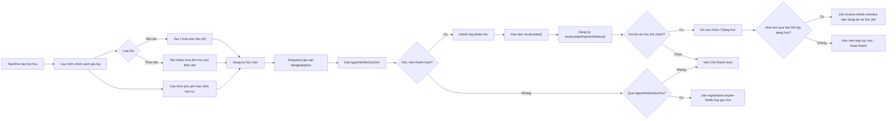

# 05A - Van hanh hoc phi, dang ky, hoa don va phieu thu

## 1. Tong quan mo hinh hien tai

He thong hien tai van hanh theo nguyen tac:

- `khoahoc` chi mo ta chuong trinh dao tao.
- `lophoc` la don vi van hanh va la noi gan chinh sach gia.
- `lophoc_chinhsachgia` quan ly gia ban cua lop.
- `dangkylophoc` luu snapshot gia tai thoi diem dang ky.
- `hoadon` la cong no phai thu.
- `phieuthu` la giao dich thu tien thuc te.

Muc tieu:

- Lop hoc co the duoc tao truoc khi cau hinh gia.
- Gia cua lop khong bi tinh lai theo so buoi thuc te.
- Hien tai khong ho tro billing theo thang.
- Chinh sach gia cua lop chi ho tro:
  - `TRON_GOI`
  - `THEO_DOT`

## 2. Bang du lieu chinh

### 2.1 `lophoc`

- Quan ly van hanh lop: giao vien, phong hoc, co so, ca hoc, lich hoc, ngay bat dau, so buoi du kien, trang thai.
- `ngayKetThuc` khong nhap tay trong form.
- `ngayKetThuc` duoc dong bo theo buoi hoc cuoi cung con hieu luc.

### 2.2 `lophoc_chinhsachgia`

- Mỗi lop toi da co 1 chinh sach gia dang ap dung.
- Cot quan trong:
  - `loaiThu`
  - `hocPhiNiemYet`
  - `soBuoiCamKet`
  - `hanThanhToanHocPhi`
  - `ghiChuChinhSach`
  - `trangThai`

Luu y:

- Khong con dung `hieuLucTu` va `hieuLucDen`.
- `hanThanhToanHocPhi` la han thanh toan mau cho hoc phi chinh neu lop thu mot lan.
- `LOAI_THU_THEO_THANG` da bi loai khoi UI va khong duoc phep dung o runtime moi.

### 2.3 `lophoc_dotthu`

- Dung cho mo hinh thu theo dot.
- Moi dot co:
  - `tenDotThu`
  - `thuTu`
  - `soTien`
  - `hanThanhToan`
  - `trangThai`

Quy tac:

- Tong tien cac dot phai bang `hocPhiNiemYet`.
- Han thanh toan phai tang dan.
- Runtime dang ky hien tai se tao nhieu hoa don hoc phi neu `loaiThu = THEO_DOT`.

### 2.4 `dangkylophoc`

- Luu dang ky hoc vien vao lop.
- Snapshot gia tai thoi diem dang ky:
  - `lopHocChinhSachGiaId`
  - `loaiThuSnapshot`
  - `hocPhiNiemYetSnapshot`
  - `giamGiaSnapshot`
  - `hocPhiPhaiThuSnapshot`
  - `soBuoiCamKetSnapshot`
  - `ghiChuGiaSnapshot`
- Cot moi:
  - `ngayHetHanGiuCho`

Y nghia `ngayHetHanGiuCho`:

- Day la han giu cho cua mot dang ky `Cho thanh toan`.
- He thong se dat gia tri nay theo han thanh toan hoc phi som nhat.
- Qua han ma chua thu duoc tien thi dang ky co the bi job he thong huy giu cho.

### 2.5 `hoadon`

- Moi hoa don hoc phi doc gia tri tien tu snapshot dang ky.
- Neu thu theo dot:
  - moi dot thu tao 1 hoa don hoc phi rieng
- Neu thu mot lan:
  - tao 1 hoa don tong
- `nguonThu` hien co:
  - `hoc_phi`
  - `phu_phi`

### 2.6 `phieuthu`

- `phieuthu` la giao dich thu tien thuc te.
- `taiKhoanId` tren `phieuthu` la hoc vien/nguoi nop tien.
- `nguoiDuyetId` la nhan su ghi nhan thu tien.
- Moi `phieuthu` hop le co the duoc xuat PDF de in hoac gui email lai tai khu vuc admin.

## 3. Mo hinh loai thu dang ho tro

### 3.1 Thu mot lan

- `loaiThu = TRON_GOI`
- Bat buoc co `hanThanhToanHocPhi`
- Tao 1 hoa don hoc phi chinh
- Hoc vien co the thanh toan nhieu lan bang nhieu phieu thu vao cung hoa don nay

### 3.2 Thu theo dot

- `loaiThu = THEO_DOT`
- Bat buoc co it nhat 1 dot thu
- Moi dot thu sinh 1 hoa don hoc phi rieng
- Trang thai dang ky duoc tinh theo tong cac hoa don hoc phi chinh

### 3.3 Khong ho tro thu theo thang

- `LOAI_THU_THEO_THANG` khong con duoc cau hinh o UI admin
- Neu du lieu cu van con gia tri nay, he thong se chan dang ky moi va bao loi nghiep vu

## 4. Luong van hanh admin

### 4.1 Tao khoa hoc

- Tao `khoahoc` de mo ta noi dung dao tao
- Khong cau hinh hoc phi o cap khoa hoc

### 4.2 Tao lop hoc

- Tao `lophoc` voi giao vien, phong, co so, ca hoc, lich hoc, ngay bat dau
- Lop o trang thai nhap co the chua co gia

### 4.3 Cau hinh chinh sach gia

Tai form tao/sua lop:

- Nhap `hocPhiNiemYet`
- Nhap `soBuoiCamKet` neu can
- Chon:
  - `Mot lan`
  - `Chia dot hoc phi`
- Neu `Mot lan`:
  - phai co `hanThanhToanHocPhi`
- Neu `Chia dot hoc phi`:
  - phai co danh sach dot thu hop le

### 4.4 Mo tuyen sinh

Chi duoc chuyen lop sang cac trang thai van hanh neu da co chinh sach gia hop le:

- `Dang tuyen sinh`
- `Chot danh sach`
- `Dang hoc`
- `Da ket thuc`

## 5. Luong dang ky hoc vien

Dang ky co 2 diem vao:

- Client tu dang ky
- Admin tao dang ky tai quay

Ca hai luong deu dung chung quy tac:

1. Kiem tra lop dang mo tuyen sinh
2. Kiem tra chinh sach gia hop le
3. Kiem tra si so
4. Kiem tra trung lich hoc
5. Kiem tra hoc vien chua co dang ky hieu luc trong lop do
6. Tao `dangkylophoc`
7. Snapshot gia
8. Tao hoa don hoc phi
9. Tao hoa don phu phi mac dinh neu co
10. Dat `ngayHetHanGiuCho`

### 5.1 Chong race condition

Luot dang ky duoc bao ve boi 2 lop:

- unique index DB: `dangkylophoc(taiKhoanId, lopHocId)`
- transaction co `lockForUpdate()` tren lop hoc khi tao dang ky

## 6. Trang thai dang ky va y nghia

- `Cho thanh toan`
  - da tao dang ky va hoa don
  - dang chiem cho
  - co `ngayHetHanGiuCho`
- `Da xac nhan`
  - da thanh toan du hoc phi chinh
  - lop chua vao hoc
- `Dang hoc`
  - da thanh toan du hoc phi chinh
  - lop da vao hoc
- `Tam dung no hoc phi`
  - hoa don hoc phi chinh qua han trong khi lop dang hoc
- `Bao luu`
  - tam ngung tham gia theo nghiep vu admin
- `Hoan thanh`
  - lop da ket thuc
- `Huy`
  - dang ky da bi huy, khong con chiem cho

## 7. Job he thong tu dong

### 7.1 `invoice:check-overdue`

Chay hang ngay luc `01:00`.

Chuc nang:

- Tim hoa don hoc phi qua han
- Recalculate trang thai dang ky
- Neu lop dang hoc va hoc phi qua han:
  - chuyen dang ky sang `Tam dung no hoc phi`
  - khoa diem danh tuong lai
- Ghi log ket qua vao file va application log

### 7.2 `registration:expire-holds`

Chay moi gio.

Chuc nang:

- Tim dang ky `Cho thanh toan` co `ngayHetHanGiuCho` da qua
- Neu chua thu duoc tien:
  - chuyen dang ky sang `Huy`
  - bo giu cho
  - them ghi chu he thong vao hoa don lien quan
- Neu da thu duoc tien:
  - bo qua, khong huy tu dong

## 8. Luong quan ly dang ky tu admin

Module admin moi o `/admin/dang-ky` ho tro:

- Tao dang ky tai quay
- Xac nhan
- Huy
- Bao luu
- Khoi phuc
- Chuyen lop

Quy tac:

- Khong duoc huy neu da phat sinh thu tien
- Khong duoc chuyen lop neu da phat sinh thu tien
- Khoi phuc se kiem tra lai si so, trung lich va trang thai lop
- Chuyen lop se:
  - huy dang ky cu
  - tao dang ky moi o lop dich
  - tao hoa don moi theo chinh sach gia cua lop dich

## 9. Luong hoa don va phieu thu

### 9.1 Sua hoa don tu admin

Khi admin sua hoa don:

- he thong cap nhat du lieu
- bat buoc goi `recalculate()` hoa don
- tu do dong bo:
  - `daTra`
  - `trangThai` hoa don
  - `trangThai` dang ky lien quan

### 9.2 Tao phiếu thu

Khi admin tao phiếu thu:

- `taiKhoanId` cua `phieuthu` = hoc vien cua hoa don
- `nguoiDuyetId` = nhan su thao tac
- sau khi tao:
  - `hoadon->recalculate()`
  - dang ky lien quan duoc tinh lai trang thai

## 10. Hien thi cho hoc vien

Khu vuc hoc vien hien tach module `Hoc phi` thanh 3 muc:

- `Tra cuu cong no`
- `Phieu thu tong hop`
- `Thanh toan truc tuyen`

Quy tac hien thi:

- Hoa don cua dang ky da bi huy giu cho se khong con hien o cong no neu chua thu tien
- Phieu thu tong hop hien theo hoc vien nop tien
- Man hinh hien nguoi ghi nhan thu tien la `nguoiDuyet`

## 11. Checklist van hanh

- Tao khoa hoc
- Tao lop hoc
- Cau hinh chinh sach gia
- Mo tuyen sinh
- Dang ky hoc vien
- Theo doi han giu cho
- Theo doi hoa don qua han
- Ghi nhan phieu thu
- Reconcile cong no va trang thai dang ky

## 12. Bieu do luong tong quat

### 9.3 Xuat hoa don va phieu thu

He thong hien tai ho tro day du 2 loai chung tu:

- `Hoa don`
- `Phieu thu`

Tai khu vuc admin:

- danh sach hoa don co nut in nhanh
- trang chi tiet hoa don co nut:
  - `In hoa don`
  - `Gui email`
- khi lap phieu thu co tuy chon:
  - `Xac nhan tao phieu thu`
  - `Luu va in phieu thu`
- trong lich su phiếu thu, tung phieu hop le co nut:
  - `In`
  - `Email`

### 9.4 Luu y mail va PDF

- PDF duoc render bang DOMPDF trong backend
- Email gui kem file PDF thong qua `FinanceDocumentService`
- Neu moi truong chua cau hinh SMTP thuc te va dang de `MAIL_MAILER=log` thi email se khong di ra ngoai
- Ban in la tai lieu nghiep vu noi bo / chung tu doi soat, khong phai hoa don dien tu theo chuan thue
- Cong hoc vien giu luong chi xem va doi soat, khong tu xuat tai lieu
