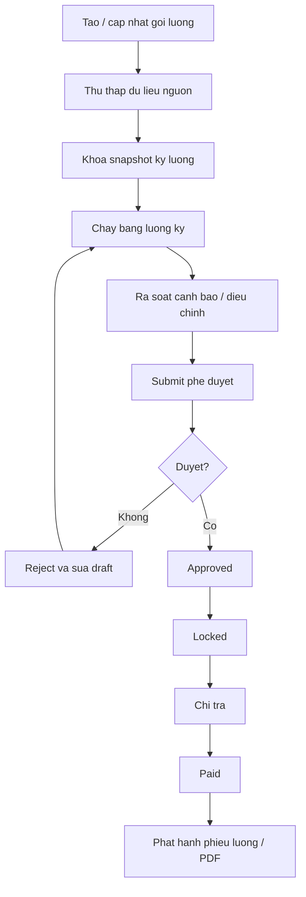

# 05B - Van hanh luong giao vien, nhan vien va payroll

## 1. Muc tieu cua tai lieu

Tai lieu nay chot 4 van de:

- Phan biet ro `goi luong` va `bang luong ky`.
- Chot mo hinh luong rieng cho `giao vien` va `nhan vien`.
- Chot quy trinh van hanh de team dev, HR, ke toan va designer cung hieu giong nhau.
- Dua ra `flow Figma chuan` de ve man hinh va prototype khong bi sai nghiep vu.

## 2. Nguyen tac quan trong nhat

He thong luong phai tach thanh 2 lop:

### 2.1 `Goi luong`

Day la thoa thuan luong dang co hieu luc cua 1 nhan su.

No tra loi cac cau hoi:

- Nhan su nay dang duoc tra theo loai nao.
- Don gia chinh la bao nhieu.
- Co phu cap co dinh, thuong co dinh, khau tru tham chieu nao.
- Goi luong nay hieu luc tu ngay nao.

`Goi luong` khong phai bang luong thang.

### 2.2 `Bang luong ky`

Day la ket qua tinh luong thuc te cua 1 ky luong.

No tra loi cac cau hoi:

- Trong ky nay nhan su duoc tinh bao nhieu.
- Du lieu tinh luong den tu dau.
- So buoi day, so gio day, so cong, OT, KPI la bao nhieu.
- Co dieu chinh tang giam nao.
- Da duoc duyet chua.
- Da chi tra chua.

Neu tron 2 lop nay vao nhau, van hanh se rat de loi.

## 3. Mo hinh he thong hien tai va ket luan

Project hien tai da co:

- `nhansu_goi_luong`
- `nhansu_goi_luong_chi_tiet`
- `nhansu.luongCoBan`

Ket luan:

- Phan hien tai moi la `ho so luong` o cap nhan su.
- Chua phai payroll ky luong.
- Muon van hanh luong chuan thi phai bo sung module `bang luong ky`.

## 4. Chot mo hinh luong theo tung nhom nhan su

## 4.1 Giao vien

Khong duoc dung 1 cong thuc chung cho tat ca giao vien.
Can chia ro theo loai hop dong va cach tra luong.

### 4.1.1 Giao vien full-time

Loai hop dong de nghi:

- `FULL_TIME`
- `PROBATION`

Loai luong de nghi:

- `MONTHLY`

Cong thuc chuan:

`Luong thuc nhan = Luong chinh + Phu cap co dinh + Thuong KPI + Thuong khac + Dieu chinh tang - Khau tru co dinh - Khau tru vi pham - Dieu chinh giam`

Nguon du lieu:

- Goi luong active
- Diem danh / cong tac / KPI
- Dieu chinh payroll

Dung cho:

- Giao vien co lich day on dinh
- Giao vien co vai tro chu nhiem, truong bo mon, quan ly hoc thuat

### 4.1.2 Giao vien part-time

Loai hop dong de nghi:

- `PART_TIME`

Loai luong de nghi:

- `PER_SESSION`
- hoac `HOURLY`

Cong thuc chuan neu theo buoi:

`Luong day = Don gia buoi x So buoi da duyet`

Cong thuc chuan neu theo gio:

`Luong day = Don gia gio x Tong gio da duyet`

Sau do:

`Luong thuc nhan = Luong day + Phu cap phat sinh + Thuong - Khau tru - Dieu chinh`

Nguon du lieu:

- Buoi hoc da dien ra va da duyet
- Gio day da duyet neu trung tam tinh theo gio
- Dieu chinh payroll

### 4.1.3 Giao vien thinh giang

Loai hop dong de nghi:

- `VISITING`

Loai luong de nghi:

- `PER_SESSION`

Khong dung `MONTHLY` cho thinh giang neu khong co ly do dac biet.

Cong thuc chuan:

`Luong thuc nhan = Don gia buoi x So buoi duoc nghiem thu + Ho tro di lai neu co - Khau tru neu co`

### 4.1.4 Quy tac chot cho giao vien

- Giao vien full-time: uu tien `MONTHLY`.
- Giao vien part-time: uu tien `PER_SESSION` hoac `HOURLY`.
- Giao vien thinh giang: uu tien `PER_SESSION`.
- Khong de HR tu do nhap cong thuc text.
- He thong chi cho chon theo cong thuc da chuan hoa.

## 4.2 Nhan vien

Nhan vien can mo hinh don gian hon giao vien.

### 4.2.1 Nhan vien full-time

Loai hop dong de nghi:

- `FULL_TIME`
- `PROBATION`

Loai luong de nghi:

- `MONTHLY`

Cong thuc chuan:

`Luong thuc nhan = Luong chinh + Phu cap + OT + Thuong + Dieu chinh tang - Khau tru - Dieu chinh giam`

Neu trung tam can tinh theo cong:

`Luong quy doi theo cong = Luong thang / Cong chuan x Cong thuc te`

Sau do:

`Luong thuc nhan = Luong quy doi theo cong + Phu cap + OT + Thuong - Khau tru`

Khuyen nghi:

- Neu trung tam chua co cham cong chuan, phase 1 chi dung `Luong chinh co dinh theo thang`.
- Khong vua lam payroll cong chuan vua cham cong thu cong neu quy trinh chua on.

### 4.2.2 Nhan vien part-time

Loai hop dong de nghi:

- `PART_TIME`

Loai luong de nghi:

- `HOURLY`
- hoac `FIXED_ALLOWANCE` neu la cong viec khoan

Cong thuc neu theo gio:

`Luong thuc nhan = Don gia gio x Tong gio duyet + Ho tro - Khau tru`

Cong thuc neu khoan:

`Luong thuc nhan = Muc khoan ky nay + Thuong - Khau tru`

### 4.2.3 Quy tac chot cho nhan vien

- Nhan vien full-time: `MONTHLY`
- Nhan vien probation: `MONTHLY`
- Nhan vien part-time: `HOURLY` hoac `FIXED_ALLOWANCE`
- Khong dung `PER_SESSION` cho nhan vien hanh chinh

## 5. Chot mapping giua role, hop dong va loai luong

| Role | Loai hop dong | Loai luong cho phep | Loai luong uu tien |
| --- | --- | --- | --- |
| Giao vien | FULL_TIME | MONTHLY | MONTHLY |
| Giao vien | PROBATION | MONTHLY, PER_SESSION | MONTHLY |
| Giao vien | PART_TIME | PER_SESSION, HOURLY | PER_SESSION |
| Giao vien | VISITING | PER_SESSION | PER_SESSION |
| Nhan vien | FULL_TIME | MONTHLY | MONTHLY |
| Nhan vien | PROBATION | MONTHLY | MONTHLY |
| Nhan vien | PART_TIME | HOURLY, FIXED_ALLOWANCE | HOURLY |

Quy tac UI:

- Khi chon `role + loaiHopDong`, UI phai loc `loaiLuong` hop le.
- Khong cho luu cau hinh sai mapping.

## 6. Du lieu chuan can co de van hanh luong

## 6.1 Master data

Can co cac danh muc:

- Loai luong
- Loai thanh phan luong
- Mau ky luong
- Nguon du lieu tinh luong
- Ly do dieu chinh luong

### 6.1.1 Loai thanh phan luong chuan

Co 2 nhom:

- Thanh phan co dinh trong `goi luong`
- Thanh phan phat sinh trong `bang luong ky`

Thanh phan co dinh:

- `LUONG_CHINH`
- `PHU_CAP_CO_DINH`
- `THUONG_CO_DINH`
- `KHAU_TRU_CO_DINH`

Thanh phan phat sinh:

- `SO_BUOI_DAY`
- `SO_GIO_DAY`
- `SO_CONG`
- `OT`
- `THUONG_KPI`
- `THUONG_DOT_XUAT`
- `KHAU_TRU_VI_PHAM`
- `DIEU_CHINH_TANG`
- `DIEU_CHINH_GIAM`

## 6.2 Bang du lieu can bo sung de co payroll thuc su

De nghi them:

- `bangluong_ky`
  - 1 ban ghi = 1 ky luong
- `bangluong_nhanvien`
  - 1 ban ghi = 1 nhan su trong 1 ky
- `bangluong_nguon_du_lieu`
  - snapshot nguon cong, buoi day, gio day, OT
- `bangluong_dieu_chinh`
  - tang giam ngoai cong thuc mac dinh
- `bangluong_pheduyet`
  - lich su submit, approve, reject
- `phieuluong`
  - file/ban in cho tung nhan su

## 7. Vong doi nghiep vu luong chuan

## 7.1 Buoc 1 - Tao va kich hoat goi luong

Tac nhan:

- HR
- Quan ly nhan su

Thuc hien:

1. Tao nhan su
2. Chon loai hop dong
3. Chon loai luong hop le
4. Nhap don gia chinh
5. Nhap chi tiet co dinh
6. Chon ngay hieu luc
7. Kich hoat goi luong

Quy tac:

- Moi nhan su chi co 1 goi luong active tai 1 thoi diem.
- Tao goi moi thi goi cu tu dong dong hieu luc.
- Goi luong chi thay doi khi co quyet dinh nhan su.

## 7.2 Buoc 2 - Thu thap du lieu nguon

Tac nhan:

- Hoc vu
- Quan ly co so
- To truong
- HR

Du lieu nguon:

- Giao vien:
  - so buoi da day
  - so gio da day
  - lop da hoan thanh
  - KPI hoc thuat
- Nhan vien:
  - so cong
  - OT
  - nghi khong luong
  - KPI

Quy tac:

- Du lieu nguon phai co trang thai `da duyet`.
- Payroll khong doc truc tiep du lieu nhap nhap.

## 7.3 Buoc 3 - Khoa du lieu ky luong

Tac nhan:

- HR payroll

Thuc hien:

1. Chon ky luong
2. Chon nhom nhan su
3. Dong bo du lieu nguon vao snapshot
4. Khoa snapshot

Quy tac:

- Sau khi khoa snapshot, thay doi ben ngoai khong duoc tu dong doi bang luong.
- Neu muon tinh lai thi phai `re-open` co kiem soat.

## 7.4 Buoc 4 - Chay bang luong

Tac nhan:

- HR payroll

He thong thuc hien:

1. Lay goi luong active tai ngay bat dau ky
2. Lay snapshot nguon du lieu
3. Tinh tong thu nhap
4. Tinh tong khau tru
5. Tinh luong thuc nhan
6. Tao bang luong nhan su
7. Gan trang thai `DRAFT`

## 7.5 Buoc 5 - Ra soat ngoai le

Tac nhan:

- HR payroll
- Quan ly co so

Canh bao ngoai le can co:

- Chua co goi luong active
- Goi luong sai loai voi hop dong
- Giao vien per-session nhung khong co buoi duyet
- Nhan vien hourly nhung khong co gio cong
- So buoi/gio/cong am hoac vuot nguong
- Dieu chinh tang giam qua nguong canh bao

## 7.6 Buoc 6 - Trinh duyet

Trang thai de nghi cho `bangluong_ky`:

- `DRAFT`
- `PENDING_APPROVAL`
- `REJECTED`
- `APPROVED`
- `LOCKED`
- `PAID`
- `CANCELLED`

Y nghia:

- `DRAFT`
  - dang tinh va sua
- `PENDING_APPROVAL`
  - da submit cho cap duyet
- `REJECTED`
  - bi tra lai de sua
- `APPROVED`
  - duoc phe duyet noi bo
- `LOCKED`
  - khong cho sua du lieu tinh luong
- `PAID`
  - da chi tra
- `CANCELLED`
  - huy ky luong do sai nghiep vu

## 7.7 Buoc 7 - Chi tra va phat hanh phieu luong

Tac nhan:

- Ke toan
- Thu quy

Thuc hien:

1. Chon bang luong da `APPROVED`
2. Chuyen `LOCKED`
3. Xac nhan chi tra
4. Danh dau `PAID`
5. Phat hanh phieu luong

Quy tac:

- Sau `PAID` khong cho sua truc tiep.
- Neu sai phai tao `dieu chinh bo sung` o ky sau hoac but toan dieu chinh rieng.

## 8. Cong thuc tinh luong chuan

## 8.1 Giao vien monthly

`Gross = Luong chinh + Tong phu cap co dinh + Thuong KPI + Thuong khac + Dieu chinh tang`

`Khau tru = Khau tru co dinh + Khau tru vi pham + Dieu chinh giam`

`Net = Gross - Khau tru`

## 8.2 Giao vien per-session

`Luong day = Don gia buoi x So buoi da nghiem thu`

`Net = Luong day + Ho tro + Thuong - Khau tru`

## 8.3 Giao vien hourly

`Luong day = Don gia gio x Tong gio da nghiem thu`

`Net = Luong day + Ho tro + Thuong - Khau tru`

## 8.4 Nhan vien monthly

Neu chua dung cong chuan:

`Net = Luong chinh + Phu cap + OT + Thuong + Dieu chinh tang - Khau tru - Dieu chinh giam`

Neu dung cong chuan:

`Luong quy doi = Luong chinh / Cong chuan x Cong thuc te`

`Net = Luong quy doi + Phu cap + OT + Thuong + Dieu chinh tang - Khau tru - Dieu chinh giam`

## 8.5 Nhan vien hourly

`Net = Don gia gio x Tong gio duyet + Ho tro + Thuong - Khau tru`

## 9. Quy tac UI de de van hanh

## 9.1 Man `Goi luong`

Phai hien thi ro:

- Role
- Loai hop dong
- Loai luong
- Don gia chinh
- Hieu luc tu / den
- Thanh phan co dinh
- Ghi chu
- Trang thai active/expired

Khong hien thi:

- Nhung truong text tu do de HR viet cong thuc.

## 9.2 Man `Bang luong ky`

Phai tach 4 vung:

- Tong quan ky luong
- Danh sach nhan su tinh luong
- Canh bao ngoai le
- Lich su phe duyet

Bang danh sach phai co cac cot:

- Ma nhan su
- Ho ten
- Role
- Loai luong
- Don gia
- Nguon du lieu
- Thu nhap gross
- Khau tru
- Thuc nhan
- Trang thai dong

## 9.3 Man `Chi tiet dong luong`

Phai hien thi:

- Snapshot goi luong tai thoi diem tinh
- Nguon du lieu da khoa
- Chi tiet cong thuc tinh
- Dieu chinh tang giam
- Lich su thao tac

## 10. Rule de tranh loi van hanh

- Khong cho tao bang luong neu con nhan su chua co goi luong active.
- Khong cho teacher `PER_SESSION` neu chua co buoi hoc da duyet.
- Khong cho employee `HOURLY` neu chua co gio cong da duyet.
- Khong cho sua goi luong active neu ky luong dang `PENDING_APPROVAL`, `APPROVED`, `LOCKED`.
- Khi thay goi luong, payroll ky truoc khong bi doi.
- Bang luong phai doc snapshot, khong doc realtime sau khi da khoa.
- Sau `PAID`, moi dieu chinh deu di qua but toan dieu chinh.

## 11. Phan quyen chuan

De nghi tach quyen:

- `nhan_su`
  - xem, tao, sua goi luong
- `bang_luong`
  - tao ky luong, chay bang luong, sua draft
- `bang_luong_duyet`
  - submit, approve, reject, lock
- `bang_luong_chi_tra`
  - danh dau da tra, xuat phieu luong

Khong de 1 role vua tao, vua duyet, vua chi tra neu trung tam muon kiem soat noi bo tot.

## 12. Flow Figma chuan

## 12.1 Danh sach page Figma de nghi

Page 1:

- `00 Foundations`
  - color, type, status chip, table, modal, drawer

Page 2:

- `01 Salary Settings`
  - list goi luong
  - create goi luong
  - edit goi luong
  - detail goi luong

Page 3:

- `02 Payroll Sources`
  - teacher session approval
  - teacher hours approval
  - employee workday approval
  - OT approval

Page 4:

- `03 Payroll Run`
  - payroll list
  - create payroll period
  - payroll detail
  - payroll warnings
  - payroll compare before/after adjustment

Page 5:

- `04 Payroll Approval`
  - submit approval modal
  - approve modal
  - reject modal
  - audit log timeline

Page 6:

- `05 Payslip`
  - payslip preview
  - payslip PDF
  - paid confirmation

## 12.2 Frame Figma chi tiet

Frame 1:

- `Salary Package List`
  - filter role
  - filter contract type
  - filter salary type
  - active/expired tab

Frame 2:

- `Create Salary Package`
  - choose staff
  - role auto fill
  - contract type
  - salary type
  - main amount
  - fixed components
  - effective date
  - notes

Frame 3:

- `Salary Package Detail`
  - active badge
  - history
  - compare previous package

Frame 4:

- `Payroll Period List`
  - month filter
  - status chips
  - create new period

Frame 5:

- `Create Payroll Run`
  - choose month
  - choose branch
  - choose staff group
  - lock source toggle
  - preview impacted staff

Frame 6:

- `Payroll Run Detail`
  - top summary cards
  - warning panel
  - staff table
  - row action: open detail

Frame 7:

- `Payroll Line Detail Drawer`
  - package snapshot
  - input source snapshot
  - formula breakdown
  - manual adjustment
  - save draft

Frame 8:

- `Approval Flow`
  - submit for approval
  - reject with reason
  - approve and lock

Frame 9:

- `Payment Confirmation`
  - payment date
  - payment method
  - payer
  - note

Frame 10:

- `Payslip Preview`
  - employee header
  - income section
  - deduction section
  - net amount
  - signatures

## 12.3 Prototype flow de designer noi frame

### Flow A - Tao goi luong

`Salary Package List -> Create Salary Package -> Confirm Modal -> Salary Package Detail`

### Flow B - Chay bang luong

`Payroll Period List -> Create Payroll Run -> Payroll Run Detail -> Payroll Line Detail Drawer -> Save Draft -> Payroll Run Detail`

### Flow C - Trinh duyet

`Payroll Run Detail -> Submit Approval Modal -> Pending Approval State -> Approve Modal -> Locked State`

### Flow D - Chi tra

`Locked Payroll Run -> Payment Confirmation -> Paid State -> Payslip Preview -> Export PDF`

## 13. Mermaid flow de dua vao Figma note hoac docs

## 14. Lo trinh implementation de nghi cho project nay

## Phase 1 - On dinh phan `goi luong`

Da co nen tiep tuc chot:

- mapping role - contract - salary type
- lich su goi luong
- snapshot goi luong vao ho so

## Phase 2 - Bo sung `bang luong ky`

Can lam:

- bang ky luong
- bang dong luong nhan su
- trang thai draft -> approved -> locked -> paid
- chi tiet cong thuc

## Phase 3 - Noi du lieu nguon

- giao vien: buoi hoc / gio day da duyet
- nhan vien: cong / OT / KPI

## Phase 4 - Phieu luong va audit

- xuat PDF phieu luong
- lich su phe duyet
- lich su dieu chinh

## 15. Chot nghiep vu de giao team

Neu muon `de hieu va de van hanh`, trung tam nen chot:

1. Giao vien full-time tinh theo `MONTHLY`.
2. Giao vien part-time va thinh giang tinh theo `PER_SESSION` tru khi trung tam co chuan `HOURLY`.
3. Nhan vien full-time tinh theo `MONTHLY`.
4. Nhan vien part-time tinh theo `HOURLY`.
5. `Goi luong` chi la hop dong luong hien hanh.
6. `Bang luong ky` moi la noi tinh va chi tra luong thuc te.
7. Du lieu nguon phai duyet truoc khi payroll doc.
8. Payroll phai co snapshot, approval va lock.

Day la mo hinh it phat sinh loi nhat va de train van hanh nhat cho he thong trung tam ngoai ngu.
