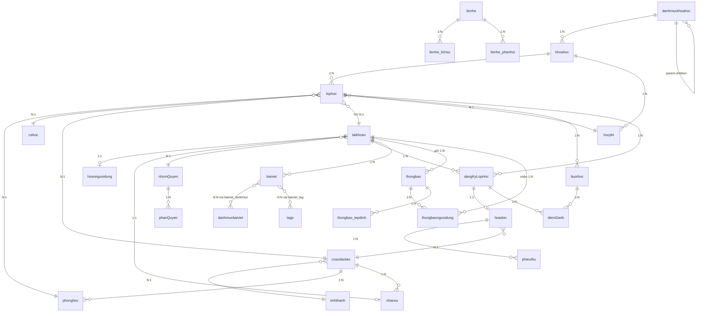

# DATABASE SCHEMA DOCUMENTATION

| Thông tin | Chi tiết |
|-----------|----------|
| **Tên dự án** | Hệ thống Quản lý Trung tâm Ngoại ngữ |
| **Database** | ☑ MySQL |
| **DB Name** | `doanchuyennganhcnpm_trungtamnn` |
| **Version** | 1.0 |
| **Ngày cập nhật** | 05/03/2026 |
| **Người cập nhật** | — |

---

## MỤC LỤC

1. [Module Auth (Xác thực & Phân quyền)](#1-module-auth)
2. [Module Content (Nội dung & Blog)](#2-module-content)
3. [Module Course (Khóa học)](#3-module-course)
4. [Module Education (Giáo dục & Lớp học)](#4-module-education)
5. [Module Facility (Cơ sở vật chất)](#5-module-facility)
6. [Module Finance (Tài chính)](#6-module-finance)
7. [Module Interaction (Tương tác)](#7-module-interaction)
8. [Laravel System Tables](#8-laravel-system-tables)
9. [Entity Relationship Diagram](#9-entity-relationship-diagram)

---

## 1. MODULE AUTH

### TABLE: `taikhoan`
**Mô tả:** Lưu thông tin tài khoản đăng nhập hệ thống (học viên, giáo viên, nhân viên, admin)

| Column | Type | Nullable | Default | Key | Description |
|--------|------|----------|---------|-----|-------------|
| taiKhoanId | INT | NO | AUTO_INC | PK | ID tài khoản |
| taiKhoan | VARCHAR(255) | NO | | UQ | Tên đăng nhập |
| email | VARCHAR(255) | NO | | | Email |
| matKhau | VARCHAR(255) | NO | | | Mật khẩu đã hash |
| role | INT | NO | 0 | | 0=Học viên, 1=Giáo viên, 2=Nhân viên, 3=Admin |
| nhomQuyenId | INT | YES | NULL | FK | FK → nhomQuyen.nhomQuyenId |
| trangThai | INT | NO | 1 | | 0=Khóa, 1=Hoạt động |
| remember_token | VARCHAR(100) | YES | NULL | | Token ghi nhớ đăng nhập |
| lastLogin | TIMESTAMP | YES | NULL | | Lần đăng nhập cuối |
| deleted_at | TIMESTAMP | YES | NULL | | Soft delete |
| created_at | TIMESTAMP | YES | NULL | | Ngày tạo |
| updated_at | TIMESTAMP | YES | NULL | | Ngày cập nhật |

**Indexes:**
- `idx_taikhoan_unique` (taiKhoan) — UNIQUE
- `idx_taikhoan_role` (role)

**Foreign Keys:**
- `nhomQuyenId` → `nhomQuyen.nhomQuyenId`

---

### TABLE: `hosonguoidung`
**Mô tả:** Lưu hồ sơ chi tiết của người dùng (thông tin cá nhân, liên hệ, người giám hộ)

| Column | Type | Nullable | Default | Key | Description |
|--------|------|----------|---------|-----|-------------|
| taiKhoanId | INT | NO | | PK, FK | FK → taikhoan.taiKhoanId |
| hoTen | VARCHAR(255) | YES | NULL | | Họ tên đầy đủ |
| soDienThoai | VARCHAR(20) | YES | NULL | | Số điện thoại |
| zalo | VARCHAR(20) | YES | NULL | | Số Zalo |
| ngaySinh | DATE | YES | NULL | | Ngày sinh |
| gioiTinh | TINYINT | YES | NULL | | 0=Nữ, 1=Nam |
| diaChi | VARCHAR(500) | YES | NULL | | Địa chỉ |
| cccd | VARCHAR(20) | YES | NULL | | Căn cước công dân |
| anhDaiDien | VARCHAR(255) | YES | NULL | | Đường dẫn ảnh đại diện |
| nguoiGiamHo | VARCHAR(255) | YES | NULL | | Tên người giám hộ |
| sdtGuardian | VARCHAR(20) | YES | NULL | | SĐT người giám hộ |
| moiQuanHe | VARCHAR(100) | YES | NULL | | Mối quan hệ với người giám hộ |
| trinhDoHienTai | VARCHAR(100) | YES | NULL | | Trình độ hiện tại |
| ngonNguMucTieu | VARCHAR(100) | YES | NULL | | Ngôn ngữ mục tiêu |
| nguonBietDen | VARCHAR(255) | YES | NULL | | Nguồn biết đến trung tâm |
| ghiChu | TEXT | YES | NULL | | Ghi chú |
| created_at | TIMESTAMP | YES | NULL | | Ngày tạo |
| updated_at | TIMESTAMP | YES | NULL | | Ngày cập nhật |

**Foreign Keys:**
- `taiKhoanId` → `taikhoan.taiKhoanId`

---

### TABLE: `nhansu`
**Mô tả:** Lưu thông tin nhân sự (giáo viên, nhân viên) bổ sung cho tài khoản

| Column | Type | Nullable | Default | Key | Description |
|--------|------|----------|---------|-----|-------------|
| taiKhoanId | INT | NO | | PK, FK | FK → taikhoan.taiKhoanId |
| maNhanVien | VARCHAR(20) | YES | NULL | UQ | Mã nhân viên |
| chucVu | VARCHAR(100) | YES | NULL | | Chức vụ |
| luongCoBan | DECIMAL(15,2) | YES | NULL | | Lương cơ bản (VNĐ) |
| ngayVaoLam | DATE | YES | NULL | | Ngày vào làm |
| chuyenMon | VARCHAR(255) | YES | NULL | | Chuyên môn |
| bangCap | VARCHAR(255) | YES | NULL | | Bằng cấp |
| hocVi | VARCHAR(100) | YES | NULL | | Học vị |
| coSoId | INT | YES | NULL | FK | FK → cosodaotao.coSoId |
| loaiHopDong | TINYINT | YES | NULL | | Loại hợp đồng |
| trangThai | TINYINT | NO | 1 | | 0=Nghỉ việc, 1=Đang làm |
| created_at | TIMESTAMP | YES | NULL | | Ngày tạo |
| updated_at | TIMESTAMP | YES | NULL | | Ngày cập nhật |

**Foreign Keys:**
- `taiKhoanId` → `taikhoan.taiKhoanId`
- `coSoId` → `cosodaotao.coSoId`

---

### TABLE: `nhomQuyen`
**Mô tả:** Nhóm quyền dùng để phân quyền cho tài khoản

| Column | Type | Nullable | Default | Key | Description |
|--------|------|----------|---------|-----|-------------|
| nhomQuyenId | INT | NO | AUTO_INC | PK | ID nhóm quyền |
| tenNhom | VARCHAR(100) | NO | | | Tên nhóm quyền |
| moTa | TEXT | YES | NULL | | Mô tả |
| created_at | TIMESTAMP | YES | NULL | | Ngày tạo |
| updated_at | TIMESTAMP | YES | NULL | | Ngày cập nhật |

---

### TABLE: `phanQuyen`
**Mô tả:** Bảng chi tiết quyền CRUD cho từng tính năng theo nhóm quyền

| Column | Type | Nullable | Default | Key | Description |
|--------|------|----------|---------|-----|-------------|
| phanQuyenId | INT | NO | AUTO_INC | PK | ID phân quyền |
| nhomQuyenId | INT | NO | | FK | FK → nhomQuyen.nhomQuyenId |
| tinhNang | VARCHAR(100) | NO | | | Tên tính năng (VD: khoa_hoc, tai_chinh) |
| coXem | BOOLEAN | NO | false | | Quyền xem |
| coThem | BOOLEAN | NO | false | | Quyền thêm |
| coSua | BOOLEAN | NO | false | | Quyền sửa |
| coXoa | BOOLEAN | NO | false | | Quyền xóa |
| created_at | TIMESTAMP | YES | NULL | | Ngày tạo |
| updated_at | TIMESTAMP | YES | NULL | | Ngày cập nhật |

**Foreign Keys:**
- `nhomQuyenId` → `nhomQuyen.nhomQuyenId`

---

## 2. MODULE CONTENT

### TABLE: `baiviet`
**Mô tả:** Lưu bài viết / blog trên hệ thống

| Column | Type | Nullable | Default | Key | Description |
|--------|------|----------|---------|-----|-------------|
| baiVietId | INT | NO | AUTO_INC | PK | ID bài viết |
| tieuDe | VARCHAR(255) | NO | | | Tiêu đề bài viết |
| slug | VARCHAR(255) | NO | | UQ | Slug URL-friendly |
| tomTat | TEXT | YES | NULL | | Tóm tắt nội dung |
| noiDung | LONGTEXT | YES | NULL | | Nội dung chi tiết (HTML) |
| anhDaiDien | VARCHAR(255) | YES | NULL | | Đường dẫn ảnh đại diện |
| taiKhoanId | INT | YES | NULL | FK | FK → taikhoan.taiKhoanId (người viết) |
| luotXem | INT | NO | 0 | | Số lượt xem |
| trangThai | TINYINT | NO | 0 | | 0=Nháp, 1=Đã xuất bản |
| deleted_at | TIMESTAMP | YES | NULL | | Soft delete |
| created_at | TIMESTAMP | YES | NULL | | Ngày tạo |
| updated_at | TIMESTAMP | YES | NULL | | Ngày cập nhật |

**Indexes:**
- `idx_baiviet_slug` (slug) — UNIQUE
- `idx_baiviet_trangthai` (trangThai)

**Foreign Keys:**
- `taiKhoanId` → `taikhoan.taiKhoanId`

---

### TABLE: `danhmucbaiviet`
**Mô tả:** Danh mục phân loại bài viết

| Column | Type | Nullable | Default | Key | Description |
|--------|------|----------|---------|-----|-------------|
| danhMucId | INT | NO | AUTO_INC | PK | ID danh mục |
| tenDanhMuc | VARCHAR(255) | NO | | | Tên danh mục |
| slug | VARCHAR(255) | NO | | UQ | Slug URL-friendly |
| moTa | TEXT | YES | NULL | | Mô tả danh mục |
| trangThai | TINYINT | NO | 1 | | 0=Ẩn, 1=Hiện |
| created_at | TIMESTAMP | YES | NULL | | Ngày tạo |
| updated_at | TIMESTAMP | YES | NULL | | Ngày cập nhật |

---

### TABLE: `baiviet_danhmuc`
**Mô tả:** Bảng pivot liên kết N-N giữa bài viết và danh mục

| Column | Type | Nullable | Default | Key | Description |
|--------|------|----------|---------|-----|-------------|
| baiVietId | INT | NO | | FK | FK → baiviet.baiVietId |
| danhMucId | INT | NO | | FK | FK → danhmucbaiviet.danhMucId |

**Foreign Keys:**
- `baiVietId` → `baiviet.baiVietId`
- `danhMucId` → `danhmucbaiviet.danhMucId`

---

### TABLE: `tags`
**Mô tả:** Thẻ tag gắn cho bài viết

| Column | Type | Nullable | Default | Key | Description |
|--------|------|----------|---------|-----|-------------|
| tagId | INT | NO | AUTO_INC | PK | ID tag |
| tenTag | VARCHAR(100) | NO | | | Tên tag |
| slug | VARCHAR(100) | NO | | UQ | Slug URL-friendly |
| created_at | TIMESTAMP | YES | NULL | | Ngày tạo |
| updated_at | TIMESTAMP | YES | NULL | | Ngày cập nhật |

---

### TABLE: `baiviet_tag`
**Mô tả:** Bảng pivot liên kết N-N giữa bài viết và tag

| Column | Type | Nullable | Default | Key | Description |
|--------|------|----------|---------|-----|-------------|
| baiVietId | INT | NO | | FK | FK → baiviet.baiVietId |
| tagId | INT | NO | | FK | FK → tags.tagId |

**Foreign Keys:**
- `baiVietId` → `baiviet.baiVietId`
- `tagId` → `tags.tagId`

---

## 3. MODULE COURSE

### TABLE: `danhmuckhoahoc`
**Mô tả:** Danh mục phân loại khóa học (hỗ trợ cây phân cấp nhiều cấp qua `parent_id`)

| Column | Type | Nullable | Default | Key | Description |
|--------|------|----------|---------|-----|-------------|
| danhMucId | INT | NO | AUTO_INC | PK | ID danh mục |
| tenDanhMuc | VARCHAR(255) | NO | | | Tên danh mục |
| slug | VARCHAR(255) | NO | | UQ | Slug URL-friendly |
| moTa | TEXT | YES | NULL | | Mô tả |
| trangThai | TINYINT | NO | 1 | | 0=Ẩn, 1=Hiện |
| parent_id | INT | YES | NULL | FK, IDX | FK → danhmuckhoahoc.danhMucId (Danh mục cha, NULL = gốc) |
| created_at | TIMESTAMP | YES | NULL | | Ngày tạo |
| updated_at | TIMESTAMP | YES | NULL | | Ngày cập nhật |

**Indexes:**
- `idx_danhmuc_parent` (parent_id)

**Foreign Keys:**
- `parent_id` → `danhmuckhoahoc.danhMucId` (Self-referencing)

---

### TABLE: `khoahoc`
**Mô tả:** Lưu thông tin khóa học do trung tâm cung cấp

| Column | Type | Nullable | Default | Key | Description |
|--------|------|----------|---------|-----|-------------|
| khoaHocId | INT | NO | AUTO_INC | PK | ID khóa học |
| danhMucId | INT | NO | | FK | FK → danhmuckhoahoc.danhMucId |
| tenKhoaHoc | VARCHAR(255) | NO | | | Tên khóa học |
| slug | VARCHAR(255) | NO | | UQ | Slug URL-friendly |
| anhKhoaHoc | VARCHAR(255) | YES | NULL | | Ảnh minh họa |
| moTa | TEXT | YES | NULL | | Mô tả khóa học |
| doiTuong | TEXT | YES | NULL | | Đối tượng học viên |
| yeuCauDauVao | TEXT | YES | NULL | | Yêu cầu đầu vào |
| ketQuaDatDuoc | TEXT | YES | NULL | | Kết quả đạt được |
| trangThai | TINYINT | NO | 1 | | 0=Ẩn, 1=Hiện |
| deleted_at | TIMESTAMP | YES | NULL | | Soft delete |
| created_at | TIMESTAMP | YES | NULL | | Ngày tạo |
| updated_at | TIMESTAMP | YES | NULL | | Ngày cập nhật |

**Foreign Keys:**
- `danhMucId` → `danhmuckhoahoc.danhMucId`

---

### TABLE: `hocphi`
**Mô tả:** Gói học phí cho từng khóa học (số buổi × đơn giá)

| Column | Type | Nullable | Default | Key | Description |
|--------|------|----------|---------|-----|-------------|
| hocPhiId | INT | NO | AUTO_INC | PK | ID gói học phí |
| khoaHocId | INT | NO | | FK | FK → khoahoc.khoaHocId |
| soBuoi | INT | NO | | | Số buổi trong gói |
| donGia | DECIMAL(15,0) | NO | | | Đơn giá mỗi buổi (VNĐ) |
| trangThai | TINYINT | NO | 1 | | 0=Ẩn, 1=Hiện |
| created_at | TIMESTAMP | YES | NULL | | Ngày tạo |
| updated_at | TIMESTAMP | YES | NULL | | Ngày cập nhật |

**Foreign Keys:**
- `khoaHocId` → `khoahoc.khoaHocId`

---

## 4. MODULE EDUCATION

### TABLE: `cahoc`
**Mô tả:** Định nghĩa các ca học trong ngày

| Column | Type | Nullable | Default | Key | Description |
|--------|------|----------|---------|-----|-------------|
| caHocId | INT | NO | AUTO_INC | PK | ID ca học |
| tenCa | VARCHAR(100) | NO | | | Tên ca học (VD: Ca sáng) |
| gioBatDau | TIME | NO | | | Giờ bắt đầu |
| gioKetThuc | TIME | NO | | | Giờ kết thúc |
| moTa | TEXT | YES | NULL | | Mô tả |
| trangThai | TINYINT | NO | 1 | | 0=Ngừng, 1=Hoạt động |
| created_at | TIMESTAMP | YES | NULL | | Ngày tạo |
| updated_at | TIMESTAMP | YES | NULL | | Ngày cập nhật |

---

### TABLE: `lophoc`
**Mô tả:** Lưu thông tin lớp học (gắn với khóa học, giáo viên, phòng học, ca học)

| Column | Type | Nullable | Default | Key | Description |
|--------|------|----------|---------|-----|-------------|
| lopHocId | INT | NO | AUTO_INC | PK | ID lớp học |
| slug | VARCHAR(255) | NO | | UQ | Slug URL-friendly |
| khoaHocId | INT | NO | | FK | FK → khoahoc.khoaHocId |
| tenLopHoc | VARCHAR(255) | NO | | | Tên lớp học |
| phongHocId | INT | YES | NULL | FK | FK → phonghoc.phongHocId |
| taiKhoanId | INT | YES | NULL | FK | FK → taikhoan.taiKhoanId (Giáo viên) |
| hocPhiId | INT | YES | NULL | FK | FK → hocphi.hocPhiId |
| ngayBatDau | DATE | YES | NULL | | Ngày bắt đầu |
| ngayKetThuc | DATE | YES | NULL | | Ngày kết thúc |
| soBuoiDuKien | INT | YES | NULL | | Số buổi dự kiến |
| soHocVienToiDa | INT | YES | NULL | | Số HV tối đa |
| donGiaDay | DECIMAL(15,2) | YES | NULL | | Đơn giá dạy/buổi (trả GV) |
| coSoId | INT | YES | NULL | FK | FK → cosodaotao.coSoId |
| caHocId | INT | YES | NULL | FK | FK → cahoc.caHocId |
| lichHoc | VARCHAR(255) | YES | NULL | | Lịch học: "2,4,6" |
| trangThai | TINYINT | NO | 0 | | 0=Sắp mở, 1=Đang mở ĐK, 2=Đã đóng, 3=Đã hủy, 4=Đang học |
| created_at | TIMESTAMP | YES | NULL | | Ngày tạo |
| updated_at | TIMESTAMP | YES | NULL | | Ngày cập nhật |

**Foreign Keys:**
- `khoaHocId` → `khoahoc.khoaHocId`
- `phongHocId` → `phonghoc.phongHocId`
- `taiKhoanId` → `taikhoan.taiKhoanId`
- `hocPhiId` → `hocphi.hocPhiId`
- `coSoId` → `cosodaotao.coSoId`
- `caHocId` → `cahoc.caHocId`

---

### TABLE: `dangKyLopHoc`
**Mô tả:** Lưu đăng ký lớp học của học viên

| Column | Type | Nullable | Default | Key | Description |
|--------|------|----------|---------|-----|-------------|
| dangKyLopHocId | INT | NO | AUTO_INC | PK | ID đăng ký |
| taiKhoanId | INT | NO | | FK | FK → taikhoan.taiKhoanId |
| lopHocId | INT | NO | | FK | FK → lophoc.lopHocId |
| ngayDangKy | DATE | YES | NULL | | Ngày đăng ký |
| trangThai | TINYINT | NO | 0 | | 0=Chờ duyệt, 1=Đang học, 2=Tạm dừng (Nợ HP), 3=Đã hủy |

**Indexes:**
- `idx_dangky_taikhoan_lophoc` (taiKhoanId, lopHocId)

**Foreign Keys:**
- `taiKhoanId` → `taikhoan.taiKhoanId`
- `lopHocId` → `lophoc.lopHocId`

---

### TABLE: `buoihoc`
**Mô tả:** Lưu thông tin từng buổi học cụ thể của lớp

| Column | Type | Nullable | Default | Key | Description |
|--------|------|----------|---------|-----|-------------|
| buoiHocId | INT | NO | AUTO_INC | PK | ID buổi học |
| lopHocId | INT | NO | | FK | FK → lophoc.lopHocId |
| tenBuoiHoc | VARCHAR(255) | YES | NULL | | Tên buổi học |
| ngayHoc | DATE | NO | | | Ngày học |
| caHocId | INT | YES | NULL | FK | FK → cahoc.caHocId |
| phongHocId | INT | YES | NULL | FK | FK → phonghoc.phongHocId |
| taiKhoanId | INT | YES | NULL | FK | FK → taikhoan.taiKhoanId (GV dạy) |
| ghiChu | TEXT | YES | NULL | | Ghi chú |
| daDiemDanh | BOOLEAN | NO | false | | Đã điểm danh chưa |
| daHoanThanh | BOOLEAN | NO | false | | Đã hoàn thành chưa |
| trangThai | TINYINT | NO | 1 | | Trạng thái buổi học |
| created_at | TIMESTAMP | YES | NULL | | Ngày tạo |
| updated_at | TIMESTAMP | YES | NULL | | Ngày cập nhật |

**Foreign Keys:**
- `lopHocId` → `lophoc.lopHocId`
- `caHocId` → `cahoc.caHocId`
- `phongHocId` → `phonghoc.phongHocId`
- `taiKhoanId` → `taikhoan.taiKhoanId`

---

### TABLE: `diemDanh`
**Mô tả:** Ghi nhận điểm danh từng học viên cho mỗi buổi học

| Column | Type | Nullable | Default | Key | Description |
|--------|------|----------|---------|-----|-------------|
| diemDanhId | BIGINT | NO | AUTO_INC | PK | ID điểm danh |
| buoiHocId | INT | NO | | FK | FK → buoihoc.buoiHocId |
| taiKhoanId | INT | NO | | FK | FK → taikhoan.taiKhoanId (Học viên) |
| dangKyLopHocId | INT | YES | NULL | FK | FK → dangKyLopHoc.dangKyLopHocId |
| trangThai | TINYINT | NO | 1 | | 0=Vắng KP, 1=Có mặt, 2=Đi trễ, 3=Có phép, 4=Bị khóa(Nợ HP) |
| coMat | TINYINT | NO | 0 | | 1=Có mặt/trễ (thống kê nhanh) |
| phutDiTre | SMALLINT | YES | NULL | | Phút đi trễ (khi trangThai=2) |
| lyDo | VARCHAR(500) | YES | NULL | | Lý do vắng/trễ/có phép |
| hinhThuc | TINYINT | NO | 0 | | 0=Trực tiếp, 1=Online |
| nguoiDiemDanhId | INT | YES | NULL | FK | FK → taikhoan.taiKhoanId (GV/Admin) |
| thoiGianDiemDanh | DATETIME | YES | NULL | | Thời điểm ghi nhận |
| ghiChu | TEXT | YES | NULL | | Ghi chú |
| created_at | TIMESTAMP | YES | NULL | | Ngày tạo |
| updated_at | TIMESTAMP | YES | NULL | | Ngày cập nhật |

**Indexes:**
- `uq_diemdanh_buoi_hocvien` (buoiHocId, taiKhoanId) — UNIQUE
- `idx_diemdanh_taikhoan` (taiKhoanId)
- `idx_diemdanh_dangky` (dangKyLopHocId)
- `idx_diemdanh_trangthai` (trangThai)
- `idx_diemdanh_nguoidiemdanh` (nguoiDiemDanhId)

**Foreign Keys:**
- `buoiHocId` → `buoihoc.buoiHocId` ON DELETE CASCADE
- `taiKhoanId` → `taikhoan.taiKhoanId` ON DELETE CASCADE
- `dangKyLopHocId` → `dangKyLopHoc.dangKyLopHocId` ON DELETE SET NULL
- `nguoiDiemDanhId` → `taikhoan.taiKhoanId` ON DELETE SET NULL

---

## 5. MODULE FACILITY

### TABLE: `tinhthanh`
**Mô tả:** Danh mục tỉnh/thành phố Việt Nam

| Column | Type | Nullable | Default | Key | Description |
|--------|------|----------|---------|-----|-------------|
| tinhThanhId | INT | NO | AUTO_INC | PK | ID tỉnh thành |
| maAPI | INT UNSIGNED | YES | NULL | UQ | Mã API provinces.open-api.vn |
| tenTinhThanh | VARCHAR(255) | NO | | | Tên tỉnh thành |
| slug | VARCHAR(255) | NO | | | Slug URL-friendly |
| division_type | VARCHAR(50) | YES | NULL | | Loại đơn vị hành chính |
| codename | VARCHAR(100) | YES | NULL | | Tên mã code |

---

### TABLE: `cosodaotao`
**Mô tả:** Lưu thông tin các cơ sở đào tạo / chi nhánh

| Column | Type | Nullable | Default | Key | Description |
|--------|------|----------|---------|-----|-------------|
| coSoId | INT | NO | AUTO_INC | PK | ID cơ sở |
| maCoSo | VARCHAR(20) | NO | | UQ | Mã cơ sở |
| slug | VARCHAR(255) | NO | | | Slug URL-friendly |
| tenCoSo | VARCHAR(255) | NO | | | Tên cơ sở |
| diaChi | VARCHAR(500) | YES | NULL | | Địa chỉ |
| soDienThoai | VARCHAR(20) | YES | NULL | | Số điện thoại |
| email | VARCHAR(255) | YES | NULL | | Email liên hệ |
| tinhThanhId | INT | YES | NULL | FK | FK → tinhthanh.tinhThanhId |
| maPhuongXa | INT UNSIGNED | YES | NULL | | Mã phường/xã từ API |
| tenPhuongXa | VARCHAR(150) | YES | NULL | | Tên phường/xã |
| viDo | DECIMAL(10,7) | YES | NULL | | Vĩ độ (bản đồ) |
| kinhDo | DECIMAL(10,7) | YES | NULL | | Kinh độ (bản đồ) |
| banDoGoogle | TEXT | YES | NULL | | Link Google Maps |
| ngayKhaiTruong | DATE | YES | NULL | | Ngày khai trương |
| trangThai | TINYINT | NO | 1 | | 0=Đóng cửa, 1=Hoạt động |
| created_at | TIMESTAMP | YES | NULL | | Ngày tạo |
| updated_at | TIMESTAMP | YES | NULL | | Ngày cập nhật |

**Foreign Keys:**
- `tinhThanhId` → `tinhthanh.tinhThanhId`

---

### TABLE: `phonghoc`
**Mô tả:** Phòng học tại mỗi cơ sở đào tạo

| Column | Type | Nullable | Default | Key | Description |
|--------|------|----------|---------|-----|-------------|
| phongHocId | INT | NO | AUTO_INC | PK | ID phòng học |
| tenPhong | VARCHAR(100) | NO | | | Tên phòng học |
| sucChua | INT | YES | NULL | | Sức chứa (người) |
| trangThietBi | TEXT | YES | NULL | | Trang thiết bị có sẵn |
| coSoId | INT | NO | | FK | FK → cosodaotao.coSoId |
| trangThai | TINYINT | NO | 1 | | 0=Bảo trì, 1=Hoạt động |

**Foreign Keys:**
- `coSoId` → `cosodaotao.coSoId`

---

## 6. MODULE FINANCE

### TABLE: `hoadon`
**Mô tả:** Hóa đơn thanh toán học phí của học viên

| Column | Type | Nullable | Default | Key | Description |
|--------|------|----------|---------|-----|-------------|
| hoaDonId | INT | NO | AUTO_INC | PK | ID hóa đơn |
| maHoaDon | VARCHAR(20) | YES | NULL | UQ | Mã hóa đơn (HD-YYYYMM-XXXXXX) |
| ngayLap | DATE | NO | | | Ngày lập hóa đơn |
| ngayHetHan | DATE | YES | NULL | | Ngày hết hạn thanh toán |
| tongTien | DECIMAL(15,2) | NO | 0 | | Tổng tiền gốc |
| giamGia | DECIMAL(15,2) | NO | 0 | | Số tiền giảm giá |
| thue | DECIMAL(5,2) | NO | 0 | | % Thuế |
| tongTienSauThue | DECIMAL(15,2) | NO | 0 | | Tổng tiền sau thuế |
| daTra | DECIMAL(15,2) | NO | 0 | | Số tiền đã trả |
| taiKhoanId | INT | NO | | FK | FK → taikhoan.taiKhoanId (Học viên) |
| nguoiLapId | BIGINT UNSIGNED | YES | NULL | FK | FK → taikhoan (Người lập) |
| dangKyLopHocId | INT | YES | NULL | FK | FK → dangKyLopHoc.dangKyLopHocId |
| phuongThucThanhToan | TINYINT | YES | NULL | | 1=Tiền mặt, 2=CK, 3=VNPay |
| loaiHoaDon | TINYINT | NO | 0 | | 0=Đăng ký mới, 1=Gia hạn, 2=Khác |
| coSoId | INT | YES | NULL | FK | FK → cosodaotao.coSoId |
| trangThai | TINYINT | NO | 0 | | 0=Chưa TT, 1=Một phần, 2=Đã TT đủ |
| ghiChu | TEXT | YES | NULL | | Ghi chú |

**Foreign Keys:**
- `taiKhoanId` → `taikhoan.taiKhoanId`
- `dangKyLopHocId` → `dangKyLopHoc.dangKyLopHocId`
- `coSoId` → `cosodaotao.coSoId`

---

### TABLE: `phieuthu`
**Mô tả:** Phiếu thu ghi nhận từng lần thu tiền cho hóa đơn

| Column | Type | Nullable | Default | Key | Description |
|--------|------|----------|---------|-----|-------------|
| phieuThuId | INT | NO | AUTO_INC | PK | ID phiếu thu |
| maPhieuThu | VARCHAR(20) | YES | NULL | UQ | Mã phiếu thu (PT-YYYYMM-XXXXXX) |
| hoaDonId | INT | NO | | FK | FK → hoadon.hoaDonId |
| soTien | DECIMAL(15,2) | NO | | | Số tiền thu |
| ngayThu | DATE | NO | | | Ngày thu |
| phuongThucThanhToan | TINYINT | NO | 1 | | 1=Tiền mặt, 2=Chuyển khoản, 3=VNPay |
| taiKhoanId | INT | YES | NULL | FK | FK → taikhoan.taiKhoanId (Người nộp) |
| nguoiDuyetId | BIGINT UNSIGNED | YES | NULL | FK | FK → taikhoan (Người duyệt) |
| ghiChu | TEXT | YES | NULL | | Ghi chú |
| trangThai | TINYINT | NO | 1 | | 0=Hủy, 1=Hợp lệ |
| created_at | TIMESTAMP | YES | NULL | | Ngày tạo |
| updated_at | TIMESTAMP | YES | NULL | | Ngày cập nhật |

**Foreign Keys:**
- `hoaDonId` → `hoadon.hoaDonId`
- `taiKhoanId` → `taikhoan.taiKhoanId`

---

## 7. MODULE INTERACTION

### TABLE: `thongbao`
**Mô tả:** Thông báo gửi đến người dùng (hệ thống, học tập, tài chính, sự kiện, khẩn cấp)

| Column | Type | Nullable | Default | Key | Description |
|--------|------|----------|---------|-----|-------------|
| thongBaoId | INT | NO | AUTO_INC | PK | ID thông báo |
| tieuDe | VARCHAR(255) | NO | | | Tiêu đề thông báo |
| noiDung | LONGTEXT | YES | NULL | | Nội dung (HTML) |
| nguoiGuiId | INT | YES | NULL | FK | FK → taikhoan.taiKhoanId |
| loaiThongBao | TINYINT | YES | NULL | | Loại thông báo |
| doiTuongGui | TINYINT | NO | 0 | | 0=Tất cả, 1=Theo lớp, 2=Theo khóa, 3=Cá nhân, 4=Theo role |
| doiTuongId | INT | YES | NULL | | ID đối tượng (lopHocId/khoaHocId/taiKhoanId) |
| ngayGui | DATETIME | YES | NULL | | Ngày giờ gửi |
| trangThai | TINYINT | NO | 1 | | Trạng thái |
| loaiGui | TINYINT | NO | 0 | | 0=Hệ thống, 1=Học tập, 2=Tài chính, 3=Sự kiện, 4=Khẩn cấp |
| uuTien | TINYINT | NO | 0 | | 0=Bình thường, 1=Quan trọng, 2=Khẩn cấp |
| ghim | BOOLEAN | NO | false | | Ghim lên đầu |
| hinhAnh | VARCHAR(255) | YES | NULL | | Ảnh đính kèm |
| created_at | TIMESTAMP | YES | NULL | | Ngày tạo |
| updated_at | TIMESTAMP | YES | NULL | | Ngày cập nhật |

**Foreign Keys:**
- `nguoiGuiId` → `taikhoan.taiKhoanId`

---

### TABLE: `thongbaonguoidung`
**Mô tả:** Bảng pivot lưu trạng thái đọc thông báo của từng người dùng

| Column | Type | Nullable | Default | Key | Description |
|--------|------|----------|---------|-----|-------------|
| thongBaoNguoiDungId | INT | NO | AUTO_INC | PK | ID |
| thongBaoId | INT | NO | | FK | FK → thongbao.thongBaoId |
| taiKhoanId | INT | NO | | FK | FK → taikhoan.taiKhoanId |
| daDoc | BOOLEAN | NO | false | | Đã đọc chưa |
| ngayDoc | DATETIME | YES | NULL | | Thời gian đọc |
| created_at | TIMESTAMP | YES | NULL | | Ngày tạo |
| updated_at | TIMESTAMP | YES | NULL | | Ngày cập nhật |

**Foreign Keys:**
- `thongBaoId` → `thongbao.thongBaoId`
- `taiKhoanId` → `taikhoan.taiKhoanId`

---

### TABLE: `thongbao_tepdinh`
**Mô tả:** Tệp đính kèm cho thông báo

| Column | Type | Nullable | Default | Key | Description |
|--------|------|----------|---------|-----|-------------|
| tepDinhId | BIGINT | NO | AUTO_INC | PK | ID tệp đính kèm |
| thongBaoId | INT | NO | | FK | FK → thongbao.thongBaoId |
| tenFile | VARCHAR(255) | NO | | | Tên file gốc người dùng |
| tenFileLuu | VARCHAR(255) | NO | | | Tên file lưu server (uuid+ext) |
| duongDan | VARCHAR(500) | NO | | | Relative path trong storage |
| loaiFile | VARCHAR(100) | YES | NULL | | MIME type |
| kichThuoc | BIGINT UNSIGNED | NO | 0 | | Kích thước (byte) |
| created_at | TIMESTAMP | YES | NULL | | Ngày tạo |
| updated_at | TIMESTAMP | YES | NULL | | Ngày cập nhật |

**Indexes:**
- `idx_tepdinh_thongbao` (thongBaoId)

**Foreign Keys:**
- `thongBaoId` → `thongbao.thongBaoId`

---

### TABLE: `lienhe`
**Mô tả:** Lưu liên hệ/yêu cầu từ khách hàng (CRM)

| Column | Type | Nullable | Default | Key | Description |
|--------|------|----------|---------|-----|-------------|
| lienHeId | INT | NO | AUTO_INC | PK | ID liên hệ |
| hoTen | VARCHAR(255) | NO | | | Họ tên người liên hệ |
| email | VARCHAR(255) | YES | NULL | | Email |
| soDienThoai | VARCHAR(20) | YES | NULL | | Số điện thoại |
| tieuDe | VARCHAR(255) | YES | NULL | | Tiêu đề |
| noiDung | TEXT | YES | NULL | | Nội dung liên hệ |
| trangThai | TINYINT | NO | 0 | | 0=Chưa xử lý, 1=Đang xử lý, 2=Đã xử lý, 3=Đã từ chối |
| taiKhoanId | INT | YES | NULL | FK | FK → taikhoan.taiKhoanId |
| loaiLienHe | ENUM | NO | 'tu_van' | | tu_van, ho_tro, khieu_nai, khac |
| ghiChuNoiBo | TEXT | YES | NULL | | Ghi chú nội bộ (admin/NV) |
| nguoiPhuTrachId | BIGINT UNSIGNED | YES | NULL | FK | FK → taikhoan (Người phụ trách) |
| thoiGianXuLy | TIMESTAMP | YES | NULL | | Thời gian xử lý xong |
| deleted_at | TIMESTAMP | YES | NULL | | Soft delete |
| created_at | TIMESTAMP | YES | NULL | | Ngày tạo |
| updated_at | TIMESTAMP | YES | NULL | | Ngày cập nhật |

**Foreign Keys:**
- `taiKhoanId` → `taikhoan.taiKhoanId`

---

### TABLE: `lienhe_lichsu`
**Mô tả:** Lịch sử thao tác trên liên hệ (audit log)

| Column | Type | Nullable | Default | Key | Description |
|--------|------|----------|---------|-----|-------------|
| lichSuId | BIGINT | NO | AUTO_INC | PK | ID lịch sử |
| lienHeId | BIGINT UNSIGNED | NO | | FK | FK → lienhe.lienHeId |
| hanhDong | VARCHAR(100) | NO | | | Hành động (tiep_nhan, cap_nhat_trang_thai, ...) |
| noiDung | TEXT | YES | NULL | | Nội dung mô tả |
| giaTriCu | VARCHAR(200) | YES | NULL | | Giá trị cũ |
| giaTriMoi | VARCHAR(200) | YES | NULL | | Giá trị mới |
| nguoiThucHienId | BIGINT UNSIGNED | YES | NULL | | ID người thực hiện |
| tenNguoiThucHien | VARCHAR(200) | YES | NULL | | Tên người thực hiện |
| created_at | TIMESTAMP | NO | CURRENT | | Thời gian tạo |

**Indexes:**
- `idx_lichsu_lienhe` (lienHeId)
- `idx_lichsu_created` (created_at)

---

### TABLE: `lienhe_phanhoi`
**Mô tả:** Phản hồi cho liên hệ (nội bộ hoặc email cho khách)

| Column | Type | Nullable | Default | Key | Description |
|--------|------|----------|---------|-----|-------------|
| phanHoiId | BIGINT | NO | AUTO_INC | PK | ID phản hồi |
| lienHeId | BIGINT UNSIGNED | NO | | FK | FK → lienhe.lienHeId |
| noiDung | TEXT | NO | | | Nội dung phản hồi |
| loai | ENUM | NO | 'noi_bo' | | noi_bo / email |
| nguoiGuiId | BIGINT UNSIGNED | YES | NULL | | ID người gửi |
| tenNguoiGui | VARCHAR(200) | YES | NULL | | Tên người gửi |
| daGuiEmail | BOOLEAN | NO | false | | Đã gửi email chưa |
| created_at | TIMESTAMP | YES | NULL | | Ngày tạo |
| updated_at | TIMESTAMP | YES | NULL | | Ngày cập nhật |

**Indexes:**
- `idx_phanhoi_lienhe` (lienHeId)

---

## 8. LARAVEL SYSTEM TABLES

### TABLE: `users`
**Mô tả:** Bảng users mặc định của Laravel (không sử dụng chính)

| Column | Type | Nullable | Default | Key | Description |
|--------|------|----------|---------|-----|-------------|
| id | BIGINT | NO | AUTO_INC | PK | ID |
| name | VARCHAR(255) | NO | | | Tên |
| email | VARCHAR(255) | NO | | UQ | Email |
| email_verified_at | TIMESTAMP | YES | NULL | | Thời gian xác minh |
| password | VARCHAR(255) | NO | | | Mật khẩu hash |
| remember_token | VARCHAR(100) | YES | NULL | | Token nhớ |
| created_at | TIMESTAMP | YES | NULL | | Ngày tạo |
| updated_at | TIMESTAMP | YES | NULL | | Ngày cập nhật |

### TABLE: `sessions`
**Mô tả:** Quản lý session người dùng

| Column | Type | Nullable | Default | Key | Description |
|--------|------|----------|---------|-----|-------------|
| id | VARCHAR(255) | NO | | PK | Session ID |
| user_id | BIGINT | YES | NULL | IDX | FK → users.id |
| ip_address | VARCHAR(45) | YES | NULL | | Địa chỉ IP |
| user_agent | TEXT | YES | NULL | | User Agent |
| payload | LONGTEXT | NO | | | Session data |
| last_activity | INT | NO | | IDX | Hoạt động cuối |

### TABLE: `password_reset_tokens`
**Mô tả:** Token đặt lại mật khẩu

| Column | Type | Nullable | Default | Key | Description |
|--------|------|----------|---------|-----|-------------|
| email | VARCHAR(255) | NO | | PK | Email |
| token | VARCHAR(255) | NO | | | Token |
| created_at | TIMESTAMP | YES | NULL | | Ngày tạo |

### TABLE: `cache` / `cache_locks`
**Mô tả:** Bảng cache hệ thống

### TABLE: `jobs` / `job_batches` / `failed_jobs`
**Mô tả:** Bảng queue jobs của Laravel

---

## 9. ENTITY RELATIONSHIP DIAGRAM

---

> **Ghi chú:**
> - Các bảng `baithi`, `diembaithi`, `noidungbaihoc`, `tailieu`, `danhgiagiaovien`, `luong`, `luongchitiet`, `phanhoi` có Model nhưng chưa được triển khai chi tiết (chưa có `$fillable`).
> - Hệ thống sử dụng **Soft Delete** cho: `taikhoan`, `khoahoc`, `baiviet`, `lienhe`.
> - Primary Key đa số dùng **INT AUTO_INCREMENT** (không dùng UUID).
> - Naming convention: camelCase cho tên cột, lowercase cho tên bảng.
