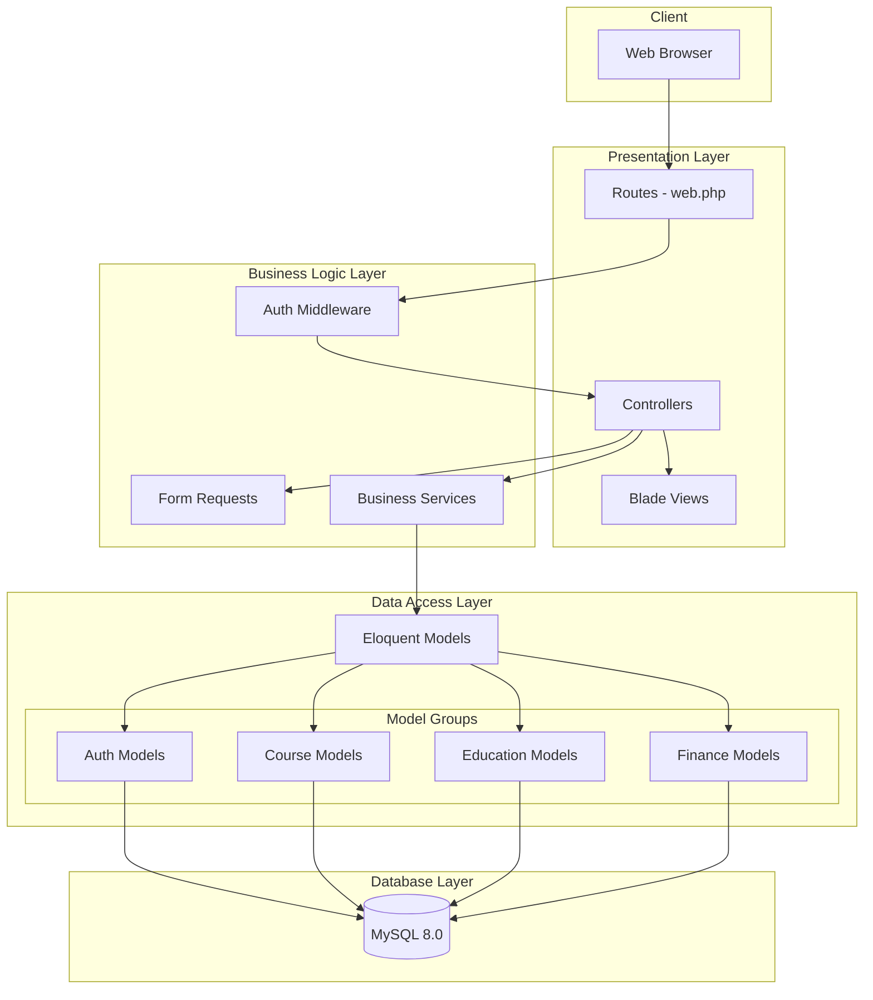

# ARCHITECTURE DECISION RECORDS (ADR)
## HỆ THỐNG QUẢN LÝ TRUNG TÂM NGOẠI NGỮ

---

# ADR-001: Lựa chọn Framework Backend

## 1. BỐI CẢNH (Context)
Hệ thống quản lý trung tâm ngoại ngữ cần một framework backend mạnh mẽ để:
- Xử lý các nghiệp vụ phức tạp (quản lý khóa học, học viên, điểm danh, tài chính)
- Hỗ trợ xác thực và phân quyền người dùng
- Tích hợp với database MySQL
- Dễ bảo trì và mở rộng trong tương lai
- Phù hợp với năng lực của team phát triển (sinh viên)

## 2. CÁC PHƯƠNG ÁN XEM XÉT (Options Considered)

| Phương án | Ưu điểm | Nhược điểm |
|-----------|---------|------------|
| **Laravel (PHP)** | - Cú pháp đẹp, dễ học<br>- Eloquent ORM mạnh mẽ<br>- Hệ sinh thái phong phú<br>- Tài liệu tốt, cộng đồng lớn<br>- Blade template engine | - Performance không bằng Node.js<br>- Hosting có thể đắt hơn |
| **Express.js (Node.js)** | - Performance cao<br>- JavaScript fullstack<br>- Nhiều package npm | - Callback hell<br>- Cấu trúc không rõ ràng<br>- Team chưa quen |
| **Django (Python)** | - Admin panel tự động<br>- ORM tốt<br>- Bảo mật cao | - Template engine không linh hoạt<br>- Learning curve cao |
| **Spring Boot (Java)** | - Enterprise-grade<br>- Performance tốt<br>- Type-safe | - Boilerplate code nhiều<br>- Cấu hình phức tạp<br>- Quá nặng cho dự án |

## 3. QUYẾT ĐỊNH (Decision)
**Chọn: Laravel 10.x (PHP 8.1+)**

Lý do:
- ✅ Team có kinh nghiệm với PHP từ các môn học trước
- ✅ Laravel có cấu trúc MVC rõ ràng, phù hợp mô hình phân lớp
- ✅ Eloquent ORM giúp thao tác database dễ dàng
- ✅ Blade template tích hợp tốt cho frontend
- ✅ Authentication scaffolding có sẵn (Laravel Breeze/UI)
- ✅ Có thể deploy dễ dàng trên XAMPP (môi trường quen thuộc)

## 4. HẬU QUẢ (Consequences)

**Tích cực:**
- Phát triển nhanh nhờ các tính năng có sẵn
- Code dễ đọc, dễ bảo trì
- Migration và Seeder giúp quản lý database tốt
- Artisan CLI tăng năng suất

**Tiêu cực:**
- Cần server hỗ trợ PHP
- Performance có thể là vấn đề khi scale lớn (chấp nhận được với quy mô dự án)

## 5. LIÊN QUAN (Related)
- ADR-002: Lựa chọn Database
- ADR-003: Kiến trúc phân lớp
- ADR-005: Authentication

---

# ADR-002: Lựa chọn Database

## 1. BỐI CẢNH (Context)
Hệ thống cần lưu trữ dữ liệu có cấu trúc bao gồm:
- Thông tin tài khoản, người dùng
- Khóa học, lớp học, lịch học
- Đăng ký, điểm danh, điểm số
- Hóa đơn, thanh toán
- Bài viết, thông báo

Yêu cầu: Quan hệ phức tạp giữa các entity, đảm bảo tính toàn vẹn dữ liệu.

## 2. CÁC PHƯƠNG ÁN XEM XÉT (Options Considered)

| Phương án | Ưu điểm | Nhược điểm |
|-----------|---------|------------|
| **MySQL** | - Quan hệ rõ ràng<br>- Hỗ trợ transaction<br>- Tích hợp tốt với Laravel<br>- Miễn phí, phổ biến | - Khó scale horizontal |
| **PostgreSQL** | - Tính năng cao cấp<br>- JSON support<br>- Performance tốt | - Phức tạp hơn MySQL<br>- Team chưa quen |
| **MongoDB** | - Schema linh hoạt<br>- Scale tốt | - Không phù hợp quan hệ phức tạp<br>- Không đảm bảo ACID |
| **SQLite** | - Nhẹ, không cần server<br>- Dễ setup | - Không phù hợp production<br>- Giới hạn concurrent |

## 3. QUYẾT ĐỊNH (Decision)
**Chọn: MySQL 8.0**

Lý do:
- ✅ Dữ liệu có cấu trúc quan hệ rõ ràng (khóa học → lớp học → học viên)
- ✅ Cần transaction cho các thao tác tài chính
- ✅ Laravel Eloquent tích hợp hoàn hảo với MySQL
- ✅ XAMPP đã có sẵn MySQL
- ✅ Team quen thuộc từ môn Cơ sở dữ liệu

## 4. HẬU QUẢ (Consequences)

**Tích cực:**
- Đảm bảo tính toàn vẹn dữ liệu với Foreign Key
- Transaction đảm bảo ACID cho các thao tác quan trọng
- Dễ backup và restore
- Eloquent relationship hoạt động tốt

**Tiêu cực:**
- Cần thiết kế schema cẩn thận từ đầu
- Migration khi thay đổi schema cần cân nhắc

## 5. LIÊN QUAN (Related)
- ADR-001: Lựa chọn Framework Backend
- ADR-004: Naming Convention

---

# ADR-003: Kiến trúc phân lớp (Layered Architecture)

## 1. BỐI CẢNH (Context)
Hệ thống cần một kiến trúc rõ ràng để:
- Phân tách trách nhiệm giữa các thành phần
- Dễ bảo trì và mở rộng
- Hỗ trợ làm việc nhóm (mỗi người phụ trách một phần)
- Dễ kiểm thử từng layer độc lập

## 2. CÁC PHƯƠNG ÁN XEM XÉT (Options Considered)

| Phương án | Ưu điểm | Nhược điểm |
|-----------|---------|------------|
| **Layered Architecture** | - Đơn giản, dễ hiểu<br>- Phân tách rõ ràng<br>- Phù hợp team nhỏ | - Có thể dư thừa layer<br>- Coupling giữa layers |
| **Clean Architecture** | - Độc lập framework<br>- Testable cao | - Phức tạp<br>- Overkill cho dự án nhỏ |
| **Microservices** | - Scale độc lập<br>- Công nghệ đa dạng | - Quá phức tạp<br>- Cần DevOps skills |
| **Monolithic MVC** | - Đơn giản nhất<br>- Laravel mặc định | - Khó scale<br>- Code lộn xộn khi lớn |

## 3. QUYẾT ĐỊNH (Decision)
**Chọn: Layered Architecture (3-tier)**

```
┌─────────────────────────────────────┐
│     PRESENTATION LAYER              │
│  (Blade Views, Controllers)         │
├─────────────────────────────────────┤
│     BUSINESS LOGIC LAYER            │
│  (Services, Validators)             │
├─────────────────────────────────────┤
│     DATA ACCESS LAYER               │
│  (Models, Eloquent ORM)             │
├─────────────────────────────────────┤
│     DATABASE LAYER                  │
│  (MySQL)                            │
└─────────────────────────────────────┘
```

Lý do:
- ✅ Cân bằng giữa đơn giản và có cấu trúc
- ✅ Phù hợp với Laravel MVC
- ✅ Dễ phân chia công việc trong nhóm
- ✅ Từng layer có thể test độc lập

## 4. HẬU QUẢ (Consequences)

**Tích cực:**
- Code có tổ chức, dễ tìm kiếm
- Thay đổi một layer không ảnh hưởng layer khác
- Mỗi thành viên có thể làm việc độc lập
- Dễ mở rộng thêm tính năng

**Tiêu cực:**
- Cần định nghĩa rõ ranh giới giữa các layer
- Có thể có code duplicate giữa layers

## 5. LIÊN QUAN (Related)
- ADR-001: Lựa chọn Framework Backend
- ADR-006: Tổ chức thư mục

---

# ADR-004: Quy ước đặt tên (Naming Convention)

## 1. BỐI CẢNH (Context)
Dự án có nhiều entities với tên tiếng Việt (KhoaHoc, LopHoc, HocVien...). Cần thống nhất quy ước đặt tên để:
- Code nhất quán trong toàn bộ dự án
- Dễ đọc và hiểu ý nghĩa
- Tránh xung đột với từ khóa tiếng Anh
- Phù hợp với chuẩn Laravel

## 2. CÁC PHƯƠNG ÁN XEM XÉT (Options Considered)

| Phương án | Ưu điểm | Nhược điểm |
|-----------|---------|------------|
| **Tiếng Việt không dấu (CamelCase)** | - Dễ hiểu với team VN<br>- Phản ánh nghiệp vụ | - Không chuẩn quốc tế<br>- Khó mở rộng |
| **Tiếng Anh thuần** | - Chuẩn quốc tế<br>- Dễ tìm tài liệu | - Team cần dịch<br>- Có thể hiểu sai nghiệp vụ |
| **Hybrid (Class VN, method EN)** | - Cân bằng<br>- Class rõ nghĩa | - Không nhất quán |

## 3. QUYẾT ĐỊNH (Decision)
**Chọn: Tiếng Việt không dấu (Vietnamese CamelCase)**

Quy ước cụ thể:

| Thành phần | Quy ước | Ví dụ |
|------------|---------|-------|
| **Model** | PascalCase, tiếng Việt | `TaiKhoan`, `KhoaHoc`, `LopHoc` |
| **Table** | snake_case, lowercase | `taikhoan`, `khoahoc`, `lophoc` |
| **Column** | camelCase | `taiKhoanId`, `hoTen`, `ngaySinh` |
| **Controller** | PascalCase + Controller | `KhoaHocController`, `LopHocController` |
| **Method** | camelCase, tiếng Anh | `index()`, `store()`, `update()` |
| **Route** | kebab-case, tiếng Việt | `/khoa-hoc`, `/lop-hoc`, `/diem-danh` |

## 4. HẬU QUẢ (Consequences)

**Tích cực:**
- Tên class/table phản ánh đúng nghiệp vụ
- Team dễ hiểu và làm việc
- Mapping giữa code và database rõ ràng

**Tiêu cực:**
- Cần quy định rõ trong coding guideline
- Developer mới cần thời gian làm quen

## 5. LIÊN QUAN (Related)
- ADR-002: Lựa chọn Database
- ADR-006: Tổ chức thư mục

---

# ADR-005: Phương thức xác thực (Authentication)

## 1. BỐI CẢNH (Context)
Hệ thống có nhiều loại người dùng với quyền hạn khác nhau:
- **Admin:** Quản lý toàn bộ hệ thống
- **Giáo viên:** Quản lý lớp học, điểm danh, nhập điểm
- **Học viên:** Đăng ký khóa học, xem điểm, thanh toán
- **Khách:** Xem thông tin khóa học, liên hệ

Cần cơ chế xác thực an toàn và phân quyền rõ ràng.

## 2. CÁC PHƯƠNG ÁN XEM XÉT (Options Considered)

| Phương án | Ưu điểm | Nhược điểm |
|-----------|---------|------------|
| **Laravel Auth (Session)** | - Có sẵn trong Laravel<br>- Dễ implement<br>- Secure mặc định | - Không phù hợp API<br>- Cần CSRF |
| **JWT Token** | - Stateless<br>- Phù hợp API/Mobile | - Phức tạp hơn<br>- Token management |
| **OAuth2/Social Login** | - UX tốt<br>- Không cần quản lý password | - Phụ thuộc bên thứ 3<br>- Phức tạp |
| **Laravel Sanctum** | - Hybrid (SPA + API)<br>- Laravel official | - Cần config thêm |

## 3. QUYẾT ĐỊNH (Decision)
**Chọn: Laravel Auth (Session-based) + Role-based Access Control**

Cấu trúc phân quyền:
```
TaiKhoan
├── role: enum('admin', 'giaovien', 'hocvien')
├── trangThai: boolean
└── Middleware: CheckRole
```

Lý do:
- ✅ Laravel Auth UI có sẵn (login, register, password reset)
- ✅ Session-based phù hợp với web application
- ✅ Dễ implement middleware kiểm tra role
- ✅ Bcrypt hashing có sẵn

## 4. HẬU QUẢ (Consequences)

**Tích cực:**
- Setup nhanh với `php artisan ui:auth`
- Bảo mật mặc định (CSRF, password hashing)
- Middleware dễ mở rộng

**Tiêu cực:**
- Không phù hợp nếu sau này cần API cho mobile app
- Session storage cần quản lý khi scale

## 5. LIÊN QUAN (Related)
- ADR-001: Lựa chọn Framework Backend
- ADR-003: Kiến trúc phân lớp

---

# ADR-006: Tổ chức thư mục Models

## 1. BỐI CẢNH (Context)
Hệ thống có nhiều Models thuộc các nhóm chức năng khác nhau:
- Auth: TaiKhoan, HoSoNguoiDung, NhanSu
- Course: KhoaHoc, LoaiKhoaHoc, BaiThi, DiemBaiThi
- Education: LopHoc, BuoiHoc, DiemDanh, DangKyLopHoc
- Finance: HoaDon, PhieuThu, Luong
- Content: BaiViet, DanhMuc, Tag
- Interaction: LienHe, ThongBao, PhanHoi

Cần tổ chức để dễ quản lý và tìm kiếm.

## 2. CÁC PHƯƠNG ÁN XEM XÉT (Options Considered)

| Phương án | Ưu điểm | Nhược điểm |
|-----------|---------|------------|
| **Flat (mặc định Laravel)** | - Đơn giản<br>- Không cần config | - Khó tìm khi nhiều model<br>- Không có tổ chức |
| **Group by Feature** | - Theo chức năng<br>- Dễ quản lý | - Cần cập nhật namespace<br>- Khác Laravel convention |
| **Domain-Driven** | - Rõ ràng từng domain<br>- Scale tốt | - Phức tạp<br>- Overkill |

## 3. QUYẾT ĐỊNH (Decision)
**Chọn: Group by Feature (Module-based)**

Cấu trúc thư mục:
```
app/Models/
├── Auth/
│   ├── TaiKhoan.php
│   ├── HoSoNguoiDung.php
│   └── NhanSu.php
├── Course/
│   ├── KhoaHoc.php
│   ├── LoaiKhoaHoc.php
│   ├── BaiThi.php
│   └── DiemBaiThi.php
├── Education/
│   ├── LopHoc.php
│   ├── BuoiHoc.php
│   ├── DiemDanh.php
│   └── DangKyLopHoc.php
├── Finance/
│   ├── HoaDon.php
│   ├── PhieuThu.php
│   └── Luong.php
├── Content/
│   ├── BaiViet.php
│   └── Tag.php
├── Interaction/
│   └── LienHe.php
└── User.php
```

## 4. HẬU QUẢ (Consequences)

**Tích cực:**
- Dễ tìm kiếm model theo nhóm chức năng
- Phản ánh rõ domain của hệ thống
- Dễ phân chia công việc trong team

**Tiêu cực:**
- Phải cập nhật namespace khi use model
- Import path dài hơn

## 5. LIÊN QUAN (Related)
- ADR-003: Kiến trúc phân lớp
- ADR-004: Naming Convention

---

# TỔNG HỢP CÁC ADR

| ADR | Quyết định | Trạng thái |
|-----|------------|------------|
| ADR-001 | Laravel 10.x (PHP 8.1+) | ✅ Accepted |
| ADR-002 | MySQL 8.0 | ✅ Accepted |
| ADR-003 | Layered Architecture (3-tier) | ✅ Accepted |
| ADR-004 | Vietnamese CamelCase Naming | ✅ Accepted |
| ADR-005 | Laravel Session Auth + RBAC | ✅ Accepted |
| ADR-006 | Group by Feature (Models) | ✅ Accepted |

---

# SƠ ĐỒ KIẾN TRÚC TỔNG QUAN


