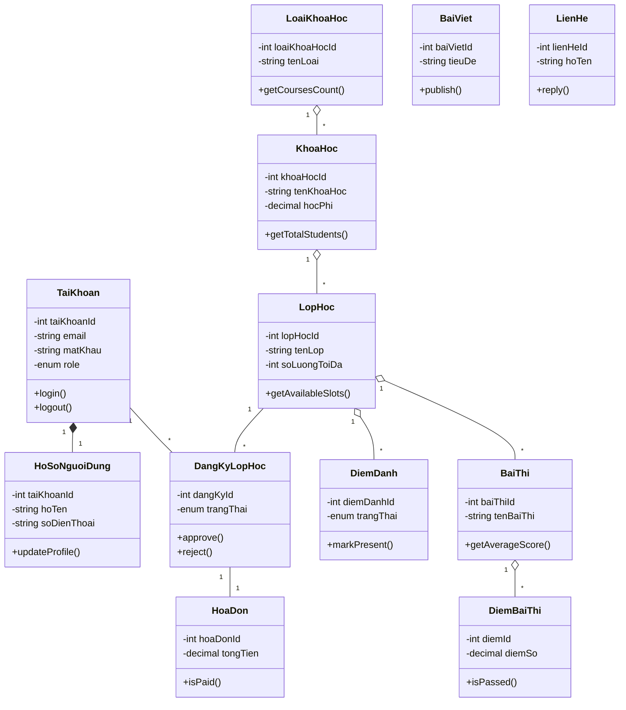

# ĐẶC TẢ CLASS CHI TIẾT
## HỆ THỐNG QUẢN LÝ TRUNG TÂM NGOẠI NGỮ

---

# CLASS 1: TaiKhoan (Account)

## CLASS SPECIFICATION

| Thuộc tính | Giá trị |
|------------|---------|
| **Class Name** | TaiKhoan |
| **Package/Module** | App\Models\Auth |
| **Stereotype** | ☑ Entity ☐ Controller ☐ Service ☐ Repository ☐ DTO |
| **Description** | Lớp đại diện cho tài khoản người dùng trong hệ thống, quản lý thông tin đăng nhập và phân quyền |

### 1. ATTRIBUTES (Thuộc tính)

| Visibility | Name | Type | Default | Description |
|------------|------|------|---------|-------------|
| - | taiKhoanId | int | AUTO_INCREMENT | Khóa chính, ID tài khoản |
| - | taiKhoan | string | NULL | Tên tài khoản đăng nhập |
| - | email | string | NULL | Email đăng nhập |
| - | matKhau | string | NULL | Mật khẩu đã mã hóa |
| - | role | enum | 'hocvien' | Vai trò: admin, giaovien, hocvien |
| - | trangThai | boolean | true | Trạng thái hoạt động |
| - | remember_token | string | NULL | Token ghi nhớ đăng nhập |
| - | lastLogin | datetime | NULL | Thời gian đăng nhập cuối |
| - | created_at | timestamp | CURRENT | Ngày tạo |
| - | updated_at | timestamp | CURRENT | Ngày cập nhật |

### 2. METHODS (Phương thức)

| Vis | Name | Parameters | Return | Description |
|-----|------|------------|--------|-------------|
| + | username() | void | string | Trả về tên trường đăng nhập |
| + | getAuthPassword() | void | string | Trả về mật khẩu đã mã hóa |
| + | hoSoNguoiDung() | void | HasOne | Quan hệ 1-1 với HoSoNguoiDung |
| + | nhanSu() | void | HasOne | Quan hệ 1-1 với NhanSu |
| + | login() | string $email, string $password | bool | Xác thực đăng nhập |
| + | logout() | void | void | Đăng xuất, hủy session |
| + | resetPassword() | string $token, string $newPassword | bool | Đặt lại mật khẩu |
| + | updateLastLogin() | void | void | Cập nhật thời gian đăng nhập |

### 3. RELATIONSHIPS (Quan hệ)

| Type | Related Class | Multiplicity | Description |
|------|---------------|--------------|-------------|
| Composition (◆) | HoSoNguoiDung | 1..1 | Mỗi tài khoản có một hồ sơ người dùng |
| Composition (◆) | NhanSu | 0..1 | Tài khoản có thể là nhân sự |
| Association | DangKyLopHoc | 1..* | Tài khoản có thể đăng ký nhiều lớp |

---

# CLASS 2: HoSoNguoiDung (UserProfile)

## CLASS SPECIFICATION

| Thuộc tính | Giá trị |
|------------|---------|
| **Class Name** | HoSoNguoiDung |
| **Package/Module** | App\Models\Auth |
| **Stereotype** | ☑ Entity ☐ Controller ☐ Service ☐ Repository ☐ DTO |
| **Description** | Lớp lưu trữ thông tin cá nhân chi tiết của người dùng |

### 1. ATTRIBUTES (Thuộc tính)

| Visibility | Name | Type | Default | Description |
|------------|------|------|---------|-------------|
| - | taiKhoanId | int | FK | Khóa chính, FK từ TaiKhoan |
| - | hoTen | string | NULL | Họ và tên đầy đủ |
| - | soDienThoai | string | NULL | Số điện thoại liên hệ |
| - | ngaySinh | date | NULL | Ngày sinh |
| - | gioiTinh | enum | NULL | Giới tính: Nam, Nữ, Khác |
| - | diaChi | string | NULL | Địa chỉ thường trú |
| - | cccd | string | NULL | Số CCCD/CMND |
| - | anhDaiDien | string | NULL | Đường dẫn ảnh đại diện |
| - | created_at | timestamp | CURRENT | Ngày tạo |
| - | updated_at | timestamp | CURRENT | Ngày cập nhật |

### 2. METHODS (Phương thức)

| Vis | Name | Parameters | Return | Description |
|-----|------|------------|--------|-------------|
| + | taiKhoan() | void | BelongsTo | Quan hệ với TaiKhoan |
| + | getFullName() | void | string | Lấy họ tên đầy đủ |
| + | getAge() | void | int | Tính tuổi từ ngày sinh |
| + | updateProfile() | array $data | bool | Cập nhật thông tin cá nhân |
| + | uploadAvatar() | File $file | string | Upload ảnh đại diện |

### 3. RELATIONSHIPS (Quan hệ)

| Type | Related Class | Multiplicity | Description |
|------|---------------|--------------|-------------|
| Association | TaiKhoan | 1..1 | Thuộc về một tài khoản |

---

# CLASS 3: KhoaHoc (Course)

## CLASS SPECIFICATION

| Thuộc tính | Giá trị |
|------------|---------|
| **Class Name** | KhoaHoc |
| **Package/Module** | App\Models\Course |
| **Stereotype** | ☑ Entity ☐ Controller ☐ Service ☐ Repository ☐ DTO |
| **Description** | Lớp đại diện cho khóa học ngoại ngữ tại trung tâm |

### 1. ATTRIBUTES (Thuộc tính)

| Visibility | Name | Type | Default | Description |
|------------|------|------|---------|-------------|
| - | khoaHocId | int | AUTO_INCREMENT | Khóa chính, ID khóa học |
| - | loaiKhoaHocId | int | FK | FK loại khóa học |
| - | tenKhoaHoc | string | NULL | Tên khóa học |
| - | moTa | text | NULL | Mô tả chi tiết khóa học |
| - | hocPhi | decimal | 0 | Học phí khóa học |
| - | thoiLuong | int | NULL | Thời lượng (số buổi) |
| - | hinhAnh | string | NULL | Đường dẫn hình ảnh |
| - | trangThai | boolean | true | Trạng thái hoạt động |
| - | created_at | timestamp | CURRENT | Ngày tạo |
| - | updated_at | timestamp | CURRENT | Ngày cập nhật |

### 2. METHODS (Phương thức)

| Vis | Name | Parameters | Return | Description |
|-----|------|------------|--------|-------------|
| + | loaiKhoaHoc() | void | BelongsTo | Quan hệ với LoaiKhoaHoc |
| + | lopHocs() | void | HasMany | Quan hệ với các lớp học |
| + | noiDungBaiHocs() | void | HasMany | Quan hệ với nội dung bài học |
| + | getTotalStudents() | void | int | Đếm tổng số học viên |
| + | getAvailableClasses() | void | Collection | Lấy các lớp đang mở |
| + | formatPrice() | void | string | Format học phí hiển thị |

### 3. RELATIONSHIPS (Quan hệ)

| Type | Related Class | Multiplicity | Description |
|------|---------------|--------------|-------------|
| Association | LoaiKhoaHoc | *..1 | Thuộc về một loại khóa học |
| Aggregation (◇) | LopHoc | 1..* | Có nhiều lớp học |
| Composition (◆) | NoiDungBaiHoc | 1..* | Chứa nhiều nội dung bài học |
| Association | TaiLieu | 1..* | Có nhiều tài liệu |

---

# CLASS 4: LoaiKhoaHoc (CourseType)

## CLASS SPECIFICATION

| Thuộc tính | Giá trị |
|------------|---------|
| **Class Name** | LoaiKhoaHoc |
| **Package/Module** | App\Models\Course |
| **Stereotype** | ☑ Entity ☐ Controller ☐ Service ☐ Repository ☐ DTO |
| **Description** | Lớp phân loại các khóa học theo chương trình (IELTS, TOEIC, Giao tiếp...) |

### 1. ATTRIBUTES (Thuộc tính)

| Visibility | Name | Type | Default | Description |
|------------|------|------|---------|-------------|
| - | loaiKhoaHocId | int | AUTO_INCREMENT | Khóa chính |
| - | tenLoai | string | NULL | Tên loại khóa học |
| - | moTa | text | NULL | Mô tả loại khóa học |
| - | icon | string | NULL | Icon hiển thị |
| - | trangThai | boolean | true | Trạng thái hoạt động |
| - | created_at | timestamp | CURRENT | Ngày tạo |
| - | updated_at | timestamp | CURRENT | Ngày cập nhật |

### 2. METHODS (Phương thức)

| Vis | Name | Parameters | Return | Description |
|-----|------|------------|--------|-------------|
| + | khoaHocs() | void | HasMany | Quan hệ với các khóa học |
| + | getCoursesCount() | void | int | Đếm số khóa học thuộc loại |
| + | getActiveCourses() | void | Collection | Lấy khóa học đang hoạt động |

### 3. RELATIONSHIPS (Quan hệ)

| Type | Related Class | Multiplicity | Description |
|------|---------------|--------------|-------------|
| Aggregation (◇) | KhoaHoc | 1..* | Chứa nhiều khóa học |

---

# CLASS 5: LopHoc (Class)

## CLASS SPECIFICATION

| Thuộc tính | Giá trị |
|------------|---------|
| **Class Name** | LopHoc |
| **Package/Module** | App\Models\Education |
| **Stereotype** | ☑ Entity ☐ Controller ☐ Service ☐ Repository ☐ DTO |
| **Description** | Lớp đại diện cho lớp học cụ thể, quản lý học viên và lịch học |

### 1. ATTRIBUTES (Thuộc tính)

| Visibility | Name | Type | Default | Description |
|------------|------|------|---------|-------------|
| - | lopHocId | int | AUTO_INCREMENT | Khóa chính |
| - | khoaHocId | int | FK | FK khóa học |
| - | giaoVienId | int | FK | FK giáo viên phụ trách |
| - | phongHocId | int | FK | FK phòng học |
| - | tenLop | string | NULL | Tên lớp học |
| - | ngayBatDau | date | NULL | Ngày bắt đầu |
| - | ngayKetThuc | date | NULL | Ngày kết thúc |
| - | soLuongToiDa | int | 30 | Số học viên tối đa |
| - | soLuongHienTai | int | 0 | Số học viên hiện tại |
| - | trangThai | enum | 'mo' | Trạng thái: mo, dangHoc, ketThuc |
| - | created_at | timestamp | CURRENT | Ngày tạo |
| - | updated_at | timestamp | CURRENT | Ngày cập nhật |

### 2. METHODS (Phương thức)

| Vis | Name | Parameters | Return | Description |
|-----|------|------------|--------|-------------|
| + | khoaHoc() | void | BelongsTo | Quan hệ với KhoaHoc |
| + | giaoVien() | void | BelongsTo | Quan hệ với NhanSu (GV) |
| + | phongHoc() | void | BelongsTo | Quan hệ với PhongHoc |
| + | buoiHocs() | void | HasMany | Quan hệ với các buổi học |
| + | dangKyLopHocs() | void | HasMany | Quan hệ với đăng ký |
| + | getAvailableSlots() | void | int | Số slot còn trống |
| + | isFull() | void | bool | Kiểm tra lớp đã đầy |
| + | getStudents() | void | Collection | Lấy danh sách học viên |

### 3. RELATIONSHIPS (Quan hệ)

| Type | Related Class | Multiplicity | Description |
|------|---------------|--------------|-------------|
| Association | KhoaHoc | *..1 | Thuộc về một khóa học |
| Association | NhanSu | *..1 | Có một giáo viên phụ trách |
| Association | PhongHoc | *..1 | Học tại một phòng học |
| Aggregation (◇) | BuoiHoc | 1..* | Có nhiều buổi học |
| Association | DangKyLopHoc | 1..* | Có nhiều đăng ký |

---

# CLASS 6: DangKyLopHoc (ClassRegistration)

## CLASS SPECIFICATION

| Thuộc tính | Giá trị |
|------------|---------|
| **Class Name** | DangKyLopHoc |
| **Package/Module** | App\Models\Education |
| **Stereotype** | ☑ Entity ☐ Controller ☐ Service ☐ Repository ☐ DTO |
| **Description** | Lớp quản lý đăng ký lớp học của học viên |

### 1. ATTRIBUTES (Thuộc tính)

| Visibility | Name | Type | Default | Description |
|------------|------|------|---------|-------------|
| - | dangKyId | int | AUTO_INCREMENT | Khóa chính |
| - | taiKhoanId | int | FK | FK tài khoản học viên |
| - | lopHocId | int | FK | FK lớp học |
| - | ngayDangKy | datetime | CURRENT | Ngày đăng ký |
| - | trangThai | enum | 'choDuyet' | Trạng thái: choDuyet, daDuyet, tuChoi, huy |
| - | ghiChu | text | NULL | Ghi chú |
| - | created_at | timestamp | CURRENT | Ngày tạo |
| - | updated_at | timestamp | CURRENT | Ngày cập nhật |

### 2. METHODS (Phương thức)

| Vis | Name | Parameters | Return | Description |
|-----|------|------------|--------|-------------|
| + | taiKhoan() | void | BelongsTo | Quan hệ với TaiKhoan |
| + | lopHoc() | void | BelongsTo | Quan hệ với LopHoc |
| + | approve() | void | bool | Duyệt đăng ký |
| + | reject() | string $reason | bool | Từ chối đăng ký |
| + | cancel() | void | bool | Hủy đăng ký |
| + | isPending() | void | bool | Kiểm tra đang chờ duyệt |

### 3. RELATIONSHIPS (Quan hệ)

| Type | Related Class | Multiplicity | Description |
|------|---------------|--------------|-------------|
| Association | TaiKhoan | *..1 | Thuộc về một tài khoản |
| Association | LopHoc | *..1 | Đăng ký vào một lớp |
| Association | HoaDon | 1..1 | Tạo một hóa đơn học phí |

---

# CLASS 7: DiemDanh (Attendance)

## CLASS SPECIFICATION

| Thuộc tính | Giá trị |
|------------|---------|
| **Class Name** | DiemDanh |
| **Package/Module** | App\Models\Education |
| **Stereotype** | ☑ Entity ☐ Controller ☐ Service ☐ Repository ☐ DTO |
| **Description** | Lớp quản lý điểm danh học viên trong từng buổi học |

### 1. ATTRIBUTES (Thuộc tính)

| Visibility | Name | Type | Default | Description |
|------------|------|------|---------|-------------|
| - | diemDanhId | int | AUTO_INCREMENT | Khóa chính |
| - | buoiHocId | int | FK | FK buổi học |
| - | taiKhoanId | int | FK | FK tài khoản học viên |
| - | trangThai | enum | 'vang' | Trạng thái: coMat, vang, coPhep, muon |
| - | ghiChu | text | NULL | Ghi chú |
| - | thoiGianDiemDanh | datetime | CURRENT | Thời gian điểm danh |
| - | created_at | timestamp | CURRENT | Ngày tạo |
| - | updated_at | timestamp | CURRENT | Ngày cập nhật |

### 2. METHODS (Phương thức)

| Vis | Name | Parameters | Return | Description |
|-----|------|------------|--------|-------------|
| + | buoiHoc() | void | BelongsTo | Quan hệ với BuoiHoc |
| + | taiKhoan() | void | BelongsTo | Quan hệ với TaiKhoan |
| + | markPresent() | void | bool | Đánh dấu có mặt |
| + | markAbsent() | void | bool | Đánh dấu vắng |
| + | markExcused() | string $reason | bool | Đánh dấu có phép |
| + | getAttendanceRate() | int $lopHocId, int $taiKhoanId | float | Tính % chuyên cần |

### 3. RELATIONSHIPS (Quan hệ)

| Type | Related Class | Multiplicity | Description |
|------|---------------|--------------|-------------|
| Association | BuoiHoc | *..1 | Thuộc về một buổi học |
| Association | TaiKhoan | *..1 | Thuộc về một học viên |

---

# CLASS 8: BaiThi (Exam)

## CLASS SPECIFICATION

| Thuộc tính | Giá trị |
|------------|---------|
| **Class Name** | BaiThi |
| **Package/Module** | App\Models\Course |
| **Stereotype** | ☑ Entity ☐ Controller ☐ Service ☐ Repository ☐ DTO |
| **Description** | Lớp quản lý các bài thi, bài kiểm tra trong khóa học |

### 1. ATTRIBUTES (Thuộc tính)

| Visibility | Name | Type | Default | Description |
|------------|------|------|---------|-------------|
| - | baiThiId | int | AUTO_INCREMENT | Khóa chính |
| - | lopHocId | int | FK | FK lớp học |
| - | tenBaiThi | string | NULL | Tên bài thi |
| - | loaiBaiThi | enum | NULL | Loại: giuaKy, cuoiKy, kiemTra |
| - | ngayThi | date | NULL | Ngày thi |
| - | thoiGianLamBai | int | 60 | Thời gian làm bài (phút) |
| - | diemToiDa | decimal | 10 | Điểm tối đa |
| - | moTa | text | NULL | Mô tả bài thi |
| - | created_at | timestamp | CURRENT | Ngày tạo |
| - | updated_at | timestamp | CURRENT | Ngày cập nhật |

### 2. METHODS (Phương thức)

| Vis | Name | Parameters | Return | Description |
|-----|------|------------|--------|-------------|
| + | lopHoc() | void | BelongsTo | Quan hệ với LopHoc |
| + | diemBaiThis() | void | HasMany | Quan hệ với điểm bài thi |
| + | getAverageScore() | void | float | Tính điểm trung bình lớp |
| + | getPassRate() | void | float | Tính tỷ lệ đạt |
| + | getHighestScore() | void | float | Lấy điểm cao nhất |
| + | getLowestScore() | void | float | Lấy điểm thấp nhất |

### 3. RELATIONSHIPS (Quan hệ)

| Type | Related Class | Multiplicity | Description |
|------|---------------|--------------|-------------|
| Association | LopHoc | *..1 | Thuộc về một lớp học |
| Aggregation (◇) | DiemBaiThi | 1..* | Có nhiều điểm bài thi |

---

# CLASS 9: DiemBaiThi (ExamScore)

## CLASS SPECIFICATION

| Thuộc tính | Giá trị |
|------------|---------|
| **Class Name** | DiemBaiThi |
| **Package/Module** | App\Models\Course |
| **Stereotype** | ☑ Entity ☐ Controller ☐ Service ☐ Repository ☐ DTO |
| **Description** | Lớp lưu trữ điểm bài thi của từng học viên |

### 1. ATTRIBUTES (Thuộc tính)

| Visibility | Name | Type | Default | Description |
|------------|------|------|---------|-------------|
| - | diemId | int | AUTO_INCREMENT | Khóa chính |
| - | baiThiId | int | FK | FK bài thi |
| - | taiKhoanId | int | FK | FK tài khoản học viên |
| - | diemSo | decimal | NULL | Điểm số đạt được |
| - | nhanXet | text | NULL | Nhận xét của giáo viên |
| - | ngayNhap | datetime | CURRENT | Ngày nhập điểm |
| - | nguoiNhap | int | FK | FK người nhập điểm |
| - | created_at | timestamp | CURRENT | Ngày tạo |
| - | updated_at | timestamp | CURRENT | Ngày cập nhật |

### 2. METHODS (Phương thức)

| Vis | Name | Parameters | Return | Description |
|-----|------|------------|--------|-------------|
| + | baiThi() | void | BelongsTo | Quan hệ với BaiThi |
| + | taiKhoan() | void | BelongsTo | Quan hệ với TaiKhoan |
| + | isPassed() | void | bool | Kiểm tra đạt (>=5) |
| + | getGrade() | void | string | Lấy xếp loại (A,B,C,D,F) |
| + | updateScore() | decimal $diem, string $nhanXet | bool | Cập nhật điểm |

### 3. RELATIONSHIPS (Quan hệ)

| Type | Related Class | Multiplicity | Description |
|------|---------------|--------------|-------------|
| Association | BaiThi | *..1 | Thuộc về một bài thi |
| Association | TaiKhoan | *..1 | Thuộc về một học viên |

---

# CLASS 10: HoaDon (Invoice)

## CLASS SPECIFICATION

| Thuộc tính | Giá trị |
|------------|---------|
| **Class Name** | HoaDon |
| **Package/Module** | App\Models\Finance |
| **Stereotype** | ☑ Entity ☐ Controller ☐ Service ☐ Repository ☐ DTO |
| **Description** | Lớp quản lý hóa đơn thanh toán học phí |

### 1. ATTRIBUTES (Thuộc tính)

| Visibility | Name | Type | Default | Description |
|------------|------|------|---------|-------------|
| - | hoaDonId | int | AUTO_INCREMENT | Khóa chính |
| - | dangKyId | int | FK | FK đăng ký lớp học |
| - | maHoaDon | string | NULL | Mã hóa đơn unique |
| - | tongTien | decimal | 0 | Tổng tiền phải thanh toán |
| - | soTienDaTra | decimal | 0 | Số tiền đã thanh toán |
| - | trangThai | enum | 'chuaThanhToan' | Trạng thái: chuaThanhToan, daThanhToan, quyHan |
| - | ngayTao | datetime | CURRENT | Ngày tạo hóa đơn |
| - | ngayThanhToan | datetime | NULL | Ngày thanh toán |
| - | hanThanhToan | date | NULL | Hạn thanh toán |
| - | ghiChu | text | NULL | Ghi chú |
| - | created_at | timestamp | CURRENT | Ngày tạo |
| - | updated_at | timestamp | CURRENT | Ngày cập nhật |

### 2. METHODS (Phương thức)

| Vis | Name | Parameters | Return | Description |
|-----|------|------------|--------|-------------|
| + | dangKyLopHoc() | void | BelongsTo | Quan hệ với DangKyLopHoc |
| + | phieuThus() | void | HasMany | Quan hệ với PhieuThu |
| + | getRemaining() | void | decimal | Tính số tiền còn nợ |
| + | isPaid() | void | bool | Kiểm tra đã thanh toán đủ |
| + | isOverdue() | void | bool | Kiểm tra quá hạn |
| + | generateInvoiceCode() | void | string | Tạo mã hóa đơn |
| + | markAsPaid() | void | bool | Đánh dấu đã thanh toán |
| + | exportPDF() | void | File | Xuất hóa đơn PDF |

### 3. RELATIONSHIPS (Quan hệ)

| Type | Related Class | Multiplicity | Description |
|------|---------------|--------------|-------------|
| Association | DangKyLopHoc | *..1 | Thuộc về một đăng ký |
| Aggregation (◇) | PhieuThu | 1..* | Có nhiều phiếu thu |

---

# CLASS 11: BaiViet (Article)

## CLASS SPECIFICATION

| Thuộc tính | Giá trị |
|------------|---------|
| **Class Name** | BaiViet |
| **Package/Module** | App\Models\Content |
| **Stereotype** | ☑ Entity ☐ Controller ☐ Service ☐ Repository ☐ DTO |
| **Description** | Lớp quản lý bài viết/blog trên website |

### 1. ATTRIBUTES (Thuộc tính)

| Visibility | Name | Type | Default | Description |
|------------|------|------|---------|-------------|
| - | baiVietId | int | AUTO_INCREMENT | Khóa chính |
| - | tieuDe | string | NULL | Tiêu đề bài viết |
| - | slug | string | NULL | Slug URL thân thiện SEO |
| - | moTaNgan | text | NULL | Mô tả ngắn/excerpt |
| - | noiDung | longtext | NULL | Nội dung đầy đủ |
| - | anhDaiDien | string | NULL | Ảnh thumbnail |
| - | tacGiaId | int | FK | FK người viết |
| - | luotXem | int | 0 | Số lượt xem |
| - | trangThai | enum | 'nhap' | Trạng thái: nhap, xuatBan, an |
| - | ngayXuatBan | datetime | NULL | Ngày xuất bản |
| - | created_at | timestamp | CURRENT | Ngày tạo |
| - | updated_at | timestamp | CURRENT | Ngày cập nhật |

### 2. METHODS (Phương thức)

| Vis | Name | Parameters | Return | Description |
|-----|------|------------|--------|-------------|
| + | danhMucs() | void | BelongsToMany | Quan hệ nhiều-nhiều với DanhMuc |
| + | tags() | void | BelongsToMany | Quan hệ nhiều-nhiều với Tag |
| + | tacGia() | void | BelongsTo | Quan hệ với NhanSu |
| + | publish() | void | bool | Xuất bản bài viết |
| + | unpublish() | void | bool | Ngừng xuất bản |
| + | incrementViews() | void | void | Tăng lượt xem |
| + | getReadingTime() | void | int | Ước tính thời gian đọc |
| + | generateSlug() | void | string | Tạo slug từ tiêu đề |

### 3. RELATIONSHIPS (Quan hệ)

| Type | Related Class | Multiplicity | Description |
|------|---------------|--------------|-------------|
| Association | DanhMucBaiViet | *..* | Thuộc nhiều danh mục |
| Association | Tag | *..* | Có nhiều tag |
| Association | NhanSu | *..1 | Thuộc về một tác giả |

---

# CLASS 12: LienHe (Contact)

## CLASS SPECIFICATION

| Thuộc tính | Giá trị |
|------------|---------|
| **Class Name** | LienHe |
| **Package/Module** | App\Models\Interaction |
| **Stereotype** | ☑ Entity ☐ Controller ☐ Service ☐ Repository ☐ DTO |
| **Description** | Lớp lưu trữ thông tin liên hệ từ khách hàng |

### 1. ATTRIBUTES (Thuộc tính)

| Visibility | Name | Type | Default | Description |
|------------|------|------|---------|-------------|
| - | lienHeId | int | AUTO_INCREMENT | Khóa chính |
| - | hoTen | string | NULL | Họ tên người liên hệ |
| - | email | string | NULL | Email liên hệ |
| - | soDienThoai | string | NULL | Số điện thoại |
| - | chuDe | string | NULL | Chủ đề liên hệ |
| - | noiDung | text | NULL | Nội dung liên hệ |
| - | trangThai | enum | 'moi' | Trạng thái: moi, daDoc, daPhanHoi |
| - | ngayGui | datetime | CURRENT | Ngày gửi |
| - | nguoiPhanHoi | int | FK | FK người phản hồi |
| - | noiDungPhanHoi | text | NULL | Nội dung phản hồi |
| - | ngayPhanHoi | datetime | NULL | Ngày phản hồi |
| - | created_at | timestamp | CURRENT | Ngày tạo |
| - | updated_at | timestamp | CURRENT | Ngày cập nhật |

### 2. METHODS (Phương thức)

| Vis | Name | Parameters | Return | Description |
|-----|------|------------|--------|-------------|
| + | markAsRead() | void | bool | Đánh dấu đã đọc |
| + | reply() | string $content, int $userId | bool | Phản hồi liên hệ |
| + | sendNotification() | void | void | Gửi email thông báo |
| + | isNew() | void | bool | Kiểm tra liên hệ mới |
| + | isReplied() | void | bool | Kiểm tra đã phản hồi |

### 3. RELATIONSHIPS (Quan hệ)

| Type | Related Class | Multiplicity | Description |
|------|---------------|--------------|-------------|
| Association | NhanSu | *..0..1 | Có thể được phản hồi bởi nhân sự |

---

# TỔNG HỢP CÁC CLASS

| STT | Class Name | Package | Stereotype | Description |
|-----|------------|---------|------------|-------------|
| 1 | TaiKhoan | Auth | Entity | Quản lý tài khoản đăng nhập |
| 2 | HoSoNguoiDung | Auth | Entity | Thông tin cá nhân người dùng |
| 3 | KhoaHoc | Course | Entity | Khóa học ngoại ngữ |
| 4 | LoaiKhoaHoc | Course | Entity | Phân loại khóa học |
| 5 | LopHoc | Education | Entity | Lớp học cụ thể |
| 6 | DangKyLopHoc | Education | Entity | Đăng ký lớp học |
| 7 | DiemDanh | Education | Entity | Điểm danh học viên |
| 8 | BaiThi | Course | Entity | Bài thi/kiểm tra |
| 9 | DiemBaiThi | Course | Entity | Điểm bài thi |
| 10 | HoaDon | Finance | Entity | Hóa đơn thanh toán |
| 11 | BaiViet | Content | Entity | Bài viết/Blog |
| 12 | LienHe | Interaction | Entity | Liên hệ khách hàng |

---

# CLASS DIAGRAM TỔNG QUAN

