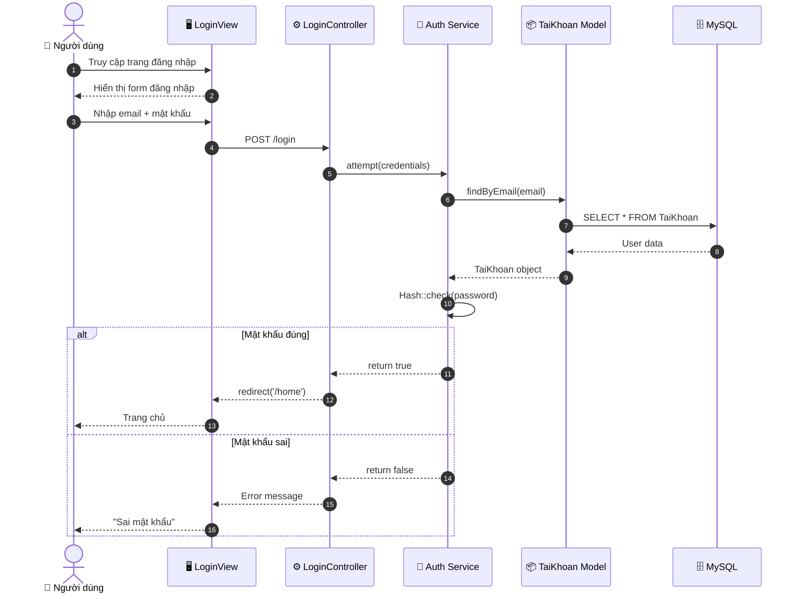
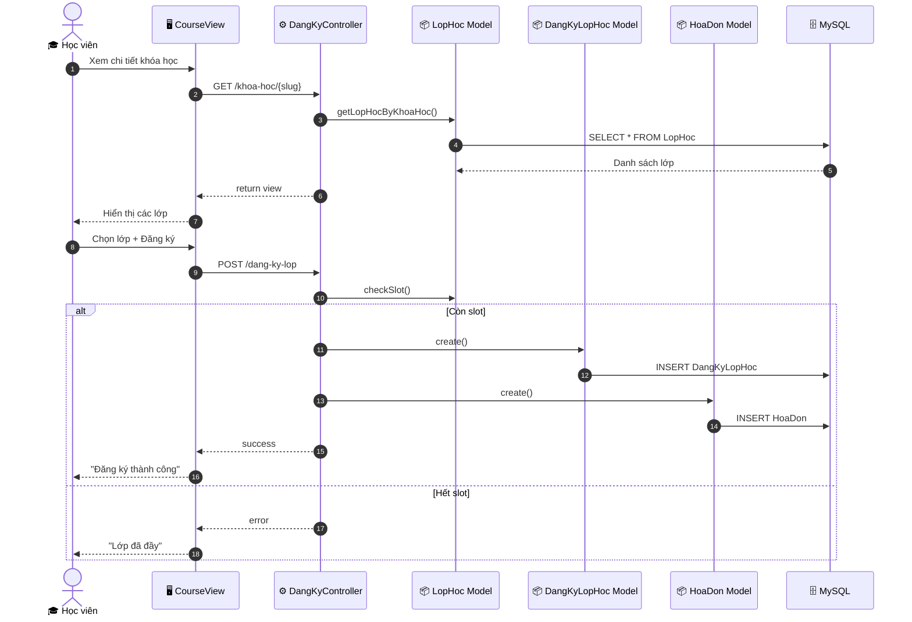
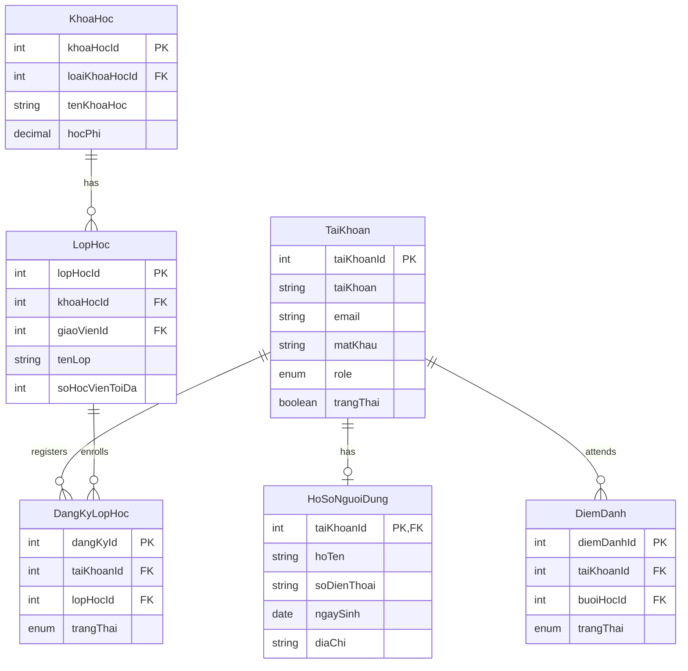
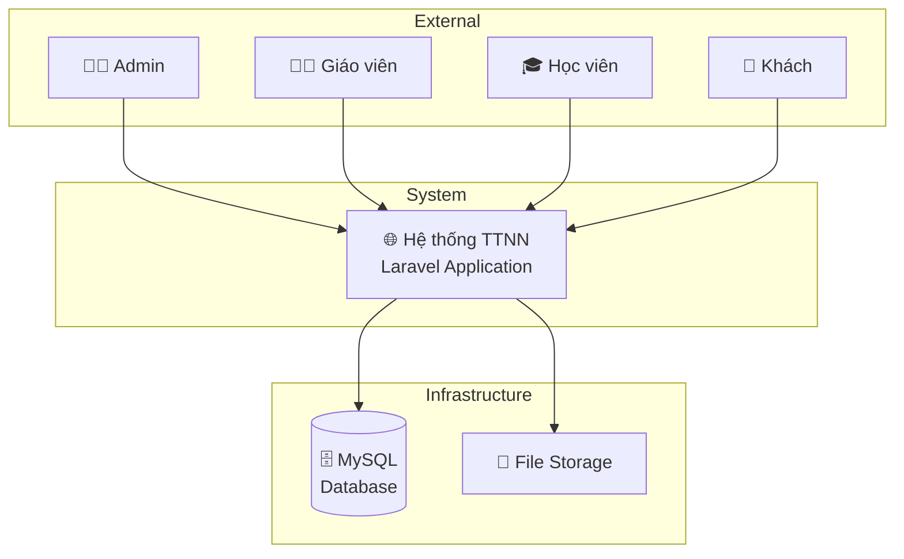

# SYSTEM ARCHITECTURE DOCUMENT
## Tài liệu Kiến trúc Hệ thống

| Thuộc tính | Giá trị |
|------------|---------|
| **Tên dự án** | Nghiên cứu Laravel & MySQL và Xây dựng hệ thống Website Trung tâm Đào tạo Ngoại ngữ |
| **Phiên bản** | 1.0 |
| **Ngày cập nhật** | 07/02/2026 |
| **Người viết** | Nhóm Five Genius |

---

# 1. TỔNG QUAN HỆ THỐNG

## 1.1. Mô tả ngắn

Hệ thống Quản lý Trung tâm Ngoại ngữ là một ứng dụng web được phát triển nhằm số hóa và tự động hóa các quy trình quản lý tại trung tâm đào tạo ngoại ngữ, bao gồm:

- **Quản lý học viên:** Đăng ký, hồ sơ, theo dõi quá trình học
- **Quản lý khóa học:** Tạo, cập nhật, phân loại khóa học
- **Quản lý lớp học:** Lịch học, giáo viên, phòng học
- **Điểm danh & Điểm số:** Theo dõi chuyên cần, nhập điểm
- **Quản lý tài chính:** Học phí, hóa đơn, thanh toán
- **Nội dung website:** Bài viết, thông báo, liên hệ

**Đối tượng sử dụng:** Admin, Giáo viên, Học viên, Khách

---

# 2. KIẾN TRÚC ÁP DỤNG

**Chọn kiến trúc:** ☐ Monolithic ☑ **Layered** ☐ Microservices ☐ Khác: ____

**Lý do chọn:**

Layered Architecture (Kiến trúc phân lớp) được chọn vì:

1. **Phù hợp quy mô dự án:** Dự án vừa và nhỏ, không cần microservices
2. **Dễ phân chia công việc:** Mỗi thành viên có thể phụ trách một layer
3. **Cấu trúc rõ ràng:** Phân tách Presentation, Business Logic, Data Access
4. **Tương thích Laravel:** Framework Laravel hỗ trợ tốt MVC pattern
5. **Dễ bảo trì:** Thay đổi một layer không ảnh hưởng layer khác

```
┌─────────────────────────────────────┐
│     PRESENTATION LAYER              │
│  (Blade Views, Controllers)         │
├─────────────────────────────────────┤
│     BUSINESS LOGIC LAYER            │
│  (Services, Form Requests)          │
├─────────────────────────────────────┤
│     DATA ACCESS LAYER               │
│  (Eloquent Models, Query Builder)   │
├─────────────────────────────────────┤
│     DATABASE LAYER                  │
│  (MySQL 8.0)                        │
└─────────────────────────────────────┘
```

---

# 3. CÔNG NGHỆ SỬ DỤNG (Technology Stack)

| Layer/Component | Technology | Version | Lý do chọn |
|-----------------|------------|---------|------------|
| **Frontend** | Blade, Bootstrap, JavaScript | Bootstrap 5 | Template engine tích hợp Laravel, responsive design |
| **Backend** | Laravel (PHP) | 10.x / PHP 8.1+ | MVC rõ ràng, Eloquent ORM mạnh, cộng đồng lớn |
| **Database** | MySQL | 8.0 | Quan hệ phức tạp, transaction, tích hợp tốt Laravel |
| **Cache** | File Cache | Laravel default | Đơn giản, phù hợp quy mô dự án |
| **Authentication** | Laravel Auth | Session-based | Có sẵn trong Laravel, bảo mật cao |
| **Hosting** | XAMPP / Apache | Apache 2.4 | Môi trường phát triển quen thuộc |

---

# 4. CÁC THÀNH PHẦN CHÍNH

*(Liệt kê các modules/services chính của hệ thống)*

| Component | Trách nhiệm | Phụ thuộc |
|-----------|-------------|-----------|
| **Auth Module** | Đăng nhập, đăng ký, phân quyền, quên mật khẩu | TaiKhoan, HoSoNguoiDung |
| **Course Module** | Quản lý khóa học, loại khóa học, nội dung bài học | KhoaHoc, LoaiKhoaHoc, TaiLieu |
| **Education Module** | Quản lý lớp học, buổi học, điểm danh, đăng ký lớp | LopHoc, BuoiHoc, DiemDanh, DangKyLopHoc |
| **Exam Module** | Quản lý bài thi, nhập điểm, xem điểm | BaiThi, DiemBaiThi |
| **Finance Module** | Quản lý học phí, hóa đơn, phiếu thu, lương | HoaDon, PhieuThu, HocPhi, Luong |
| **Content Module** | Quản lý bài viết, danh mục, tags | BaiViet, DanhMucBaiViet, Tag |
| **Facility Module** | Quản lý cơ sở, phòng học | CoSoDaoTao, PhongHoc |
| **Interaction Module** | Liên hệ, thông báo, phản hồi | LienHe, ThongBao, PhanHoi |

---

# 5. THAM CHIẾU DIAGRAMS

| Diagram | Link/File |
|---------|-----------|
| **Use Case Diagram** | `docs/mermaid_usecase_code.txt` |
| **Class Diagram** | `docs/class_specification.md` |
| **Sequence Diagrams** | `docs/system_architecture.md` (phần 6) |
| **ERD** | `docs/system_architecture.md` (phần 7) |
| **System Context Diagram** | `docs/system_architecture.md` (phần 8) |

---

# 6. SEQUENCE DIAGRAMS

## 6.1. Sequence Diagram - Đăng nhập



## 6.2. Sequence Diagram - Đăng ký khóa học



---

# 7. ERD (Entity Relationship Diagram)



---

# 8. SYSTEM CONTEXT DIAGRAM


