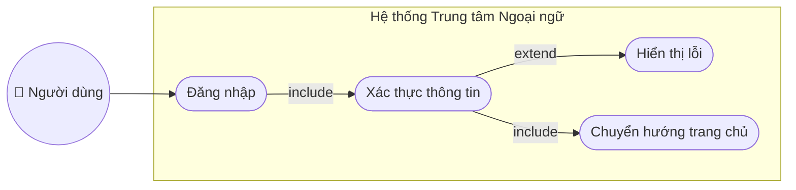
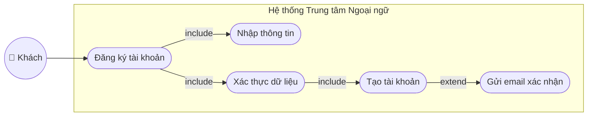
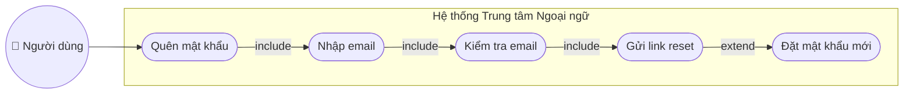
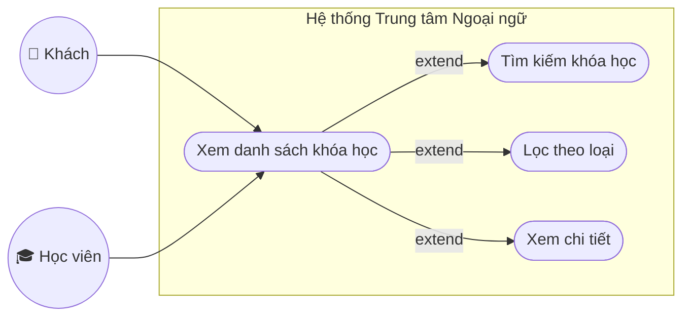
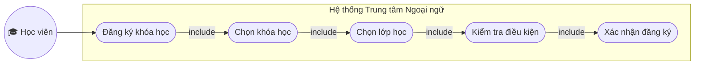
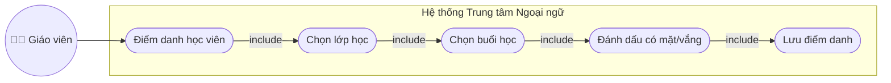
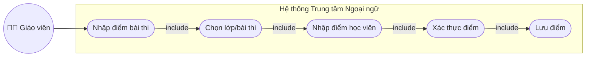
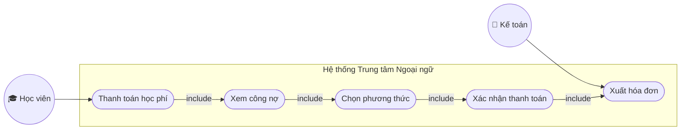
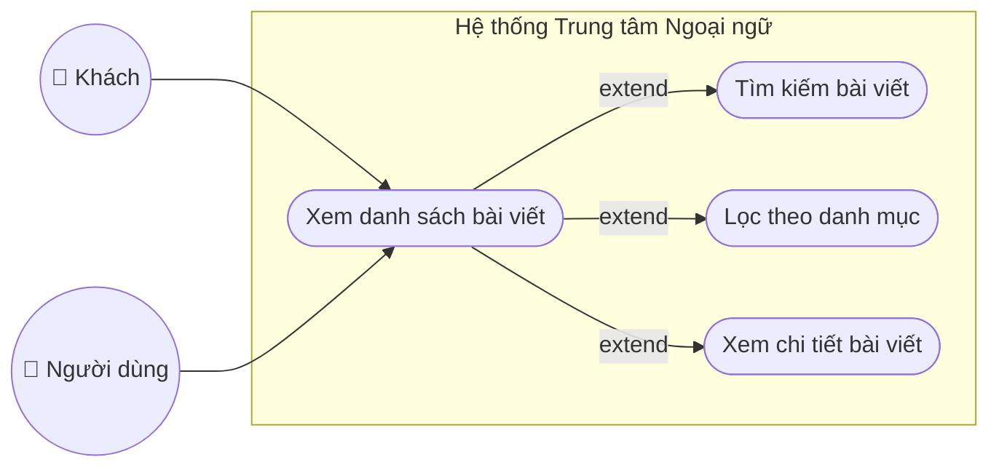
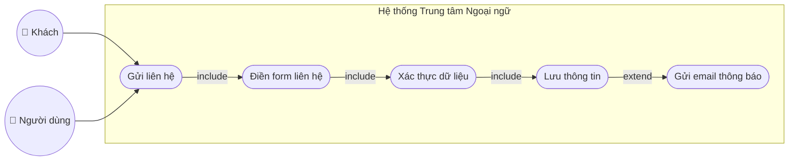

# ĐẶC TẢ USE CASE CHI TIẾT
## HỆ THỐNG QUẢN LÝ TRUNG TÂM NGOẠI NGỮ

---

# USE CASE 1: ĐĂNG NHẬP

## USE CASE SPECIFICATION

| Thuộc tính | Giá trị |
|------------|---------|
| **Use Case ID** | UC-001 |
| **Use Case Name** | Đăng nhập |
| **Actor(s)** | Người dùng (Học viên, Giáo viên, Quản trị viên) |
| **Priority** | ☑ High ☐ Medium ☐ Low |
| **Version** | 1.0 |
| **Last Updated** | 05/02/2026 |

### 1. MÔ TẢ NGẮN (Brief Description)
Cho phép người dùng đã có tài khoản đăng nhập vào hệ thống bằng email và mật khẩu để truy cập các chức năng tương ứng với vai trò của mình.

**Biểu đồ Use Case:**

### 2. ĐIỀU KIỆN TIÊN QUYẾT (Preconditions)
1. Người dùng đã có tài khoản trong hệ thống
2. Người dùng chưa đăng nhập
3. Hệ thống hoạt động bình thường

### 3. LUỒNG CHÍNH (Main Flow / Basic Flow)
| Bước | Actor Action | System Response |
|------|--------------|-----------------|
| 1 | Người dùng truy cập trang đăng nhập | Hệ thống hiển thị form đăng nhập với các trường: Email, Mật khẩu |
| 2 | Người dùng nhập email | Hệ thống ghi nhận email |
| 3 | Người dùng nhập mật khẩu | Hệ thống ghi nhận mật khẩu (ẩn ký tự) |
| 4 | Người dùng nhấn nút "Đăng nhập" | Hệ thống xác thực thông tin đăng nhập |
| 5 | - | Hệ thống tạo session cho người dùng |
| 6 | - | Hệ thống chuyển hướng đến trang chủ tương ứng với vai trò |
| 7 | - | Hệ thống hiển thị thông báo "Đăng nhập thành công" |

### 4. LUỒNG PHỤ (Alternative Flows)

**4a. Email không tồn tại**
- Điều kiện: Email không có trong hệ thống
- Các bước:
  1. Hệ thống hiển thị thông báo "Email không tồn tại"
  2. Quay lại bước 2 của luồng chính

**4b. Mật khẩu không đúng**
- Điều kiện: Mật khẩu nhập vào không khớp với mật khẩu trong database
- Các bước:
  1. Hệ thống hiển thị thông báo "Mật khẩu không chính xác"
  2. Quay lại bước 3 của luồng chính

**4c. Tài khoản bị khóa**
- Điều kiện: Tài khoản đã bị quản trị viên khóa
- Các bước:
  1. Hệ thống hiển thị thông báo "Tài khoản đã bị khóa. Vui lòng liên hệ quản trị viên"
  2. Kết thúc use case

### 5. HẬU ĐIỀU KIỆN (Postconditions)
- **Thành công:** Người dùng được đăng nhập vào hệ thống, session được tạo, chuyển hướng đến trang chủ
- **Thất bại:** Người dùng vẫn ở trang đăng nhập, hiển thị thông báo lỗi tương ứng

---

# USE CASE 2: ĐĂNG KÝ TÀI KHOẢN

## USE CASE SPECIFICATION

| Thuộc tính | Giá trị |
|------------|---------|
| **Use Case ID** | UC-002 |
| **Use Case Name** | Đăng ký tài khoản |
| **Actor(s)** | Khách (Guest) |
| **Priority** | ☑ High ☐ Medium ☐ Low |
| **Version** | 1.0 |
| **Last Updated** | 05/02/2026 |

### 1. MÔ TẢ NGẮN (Brief Description)
Cho phép khách truy cập đăng ký tài khoản mới để trở thành học viên của trung tâm ngoại ngữ.

**Biểu đồ Use Case:**

### 2. ĐIỀU KIỆN TIÊN QUYẾT (Preconditions)
1. Khách chưa có tài khoản trong hệ thống
2. Khách có email hợp lệ
3. Hệ thống hoạt động bình thường

### 3. LUỒNG CHÍNH (Main Flow / Basic Flow)
| Bước | Actor Action | System Response |
|------|--------------|-----------------|
| 1 | Khách truy cập trang đăng ký | Hệ thống hiển thị form đăng ký |
| 2 | Khách nhập họ tên | Hệ thống ghi nhận họ tên |
| 3 | Khách nhập email | Hệ thống ghi nhận email |
| 4 | Khách nhập mật khẩu | Hệ thống ghi nhận mật khẩu |
| 5 | Khách nhập xác nhận mật khẩu | Hệ thống kiểm tra khớp mật khẩu |
| 6 | Khách nhập số điện thoại | Hệ thống ghi nhận số điện thoại |
| 7 | Khách nhấn nút "Đăng ký" | Hệ thống xác thực toàn bộ dữ liệu |
| 8 | - | Hệ thống mã hóa mật khẩu và lưu tài khoản |
| 9 | - | Hệ thống gửi email xác nhận (nếu có) |
| 10 | - | Hệ thống chuyển hướng đến trang đăng nhập |
| 11 | - | Hệ thống hiển thị thông báo "Đăng ký thành công" |

### 4. LUỒNG PHỤ (Alternative Flows)

**4a. Email đã tồn tại**
- Điều kiện: Email đã được đăng ký trước đó
- Các bước:
  1. Hệ thống hiển thị thông báo "Email đã được sử dụng"
  2. Quay lại bước 3 của luồng chính

**4b. Mật khẩu không khớp**
- Điều kiện: Mật khẩu và xác nhận mật khẩu không giống nhau
- Các bước:
  1. Hệ thống hiển thị thông báo "Mật khẩu xác nhận không khớp"
  2. Quay lại bước 5 của luồng chính

**4c. Dữ liệu không hợp lệ**
- Điều kiện: Email sai định dạng hoặc mật khẩu quá ngắn
- Các bước:
  1. Hệ thống hiển thị các lỗi validation tương ứng
  2. Quay lại bước có lỗi

### 5. HẬU ĐIỀU KIỆN (Postconditions)
- **Thành công:** Tài khoản mới được tạo trong database, người dùng có thể đăng nhập
- **Thất bại:** Tài khoản không được tạo, hiển thị thông báo lỗi

---

# USE CASE 3: QUÊN MẬT KHẨU

## USE CASE SPECIFICATION

| Thuộc tính | Giá trị |
|------------|---------|
| **Use Case ID** | UC-003 |
| **Use Case Name** | Quên mật khẩu |
| **Actor(s)** | Người dùng |
| **Priority** | ☐ High ☑ Medium ☐ Low |
| **Version** | 1.0 |
| **Last Updated** | 05/02/2026 |

### 1. MÔ TẢ NGẮN (Brief Description)
Cho phép người dùng yêu cầu đặt lại mật khẩu khi quên mật khẩu đăng nhập thông qua email.

**Biểu đồ Use Case:**

### 2. ĐIỀU KIỆN TIÊN QUYẾT (Preconditions)
1. Người dùng đã có tài khoản trong hệ thống
2. Người dùng có quyền truy cập email đã đăng ký
3. Hệ thống email hoạt động bình thường

### 3. LUỒNG CHÍNH (Main Flow / Basic Flow)
| Bước | Actor Action | System Response |
|------|--------------|-----------------|
| 1 | Người dùng nhấn link "Quên mật khẩu" | Hệ thống hiển thị form nhập email |
| 2 | Người dùng nhập email đã đăng ký | Hệ thống ghi nhận email |
| 3 | Người dùng nhấn "Gửi yêu cầu" | Hệ thống kiểm tra email tồn tại |
| 4 | - | Hệ thống tạo token reset password |
| 5 | - | Hệ thống gửi email chứa link đặt lại mật khẩu |
| 6 | - | Hệ thống hiển thị thông báo "Đã gửi email reset password" |
| 7 | Người dùng mở email và nhấn link | Hệ thống hiển thị form đặt mật khẩu mới |
| 8 | Người dùng nhập mật khẩu mới | Hệ thống ghi nhận mật khẩu mới |
| 9 | Người dùng nhấn "Đặt lại mật khẩu" | Hệ thống cập nhật mật khẩu mới |
| 10 | - | Hệ thống chuyển hướng đến trang đăng nhập |

### 4. LUỒNG PHỤ (Alternative Flows)

**4a. Email không tồn tại**
- Điều kiện: Email không có trong hệ thống
- Các bước:
  1. Hệ thống hiển thị thông báo "Email không tồn tại trong hệ thống"
  2. Quay lại bước 2 của luồng chính

**4b. Link hết hạn**
- Điều kiện: Token reset đã hết hạn (quá 60 phút)
- Các bước:
  1. Hệ thống hiển thị thông báo "Link đã hết hạn"
  2. Yêu cầu người dùng gửi lại yêu cầu mới

### 5. HẬU ĐIỀU KIỆN (Postconditions)
- **Thành công:** Mật khẩu được cập nhật, người dùng có thể đăng nhập với mật khẩu mới
- **Thất bại:** Mật khẩu không thay đổi, hiển thị thông báo lỗi

---

# USE CASE 4: XEM DANH SÁCH KHÓA HỌC

## USE CASE SPECIFICATION

| Thuộc tính | Giá trị |
|------------|---------|
| **Use Case ID** | UC-004 |
| **Use Case Name** | Xem danh sách khóa học |
| **Actor(s)** | Khách, Học viên |
| **Priority** | ☑ High ☐ Medium ☐ Low |
| **Version** | 1.0 |
| **Last Updated** | 05/02/2026 |

### 1. MÔ TẢ NGẮN (Brief Description)
Cho phép người dùng xem danh sách các khóa học đang được cung cấp tại trung tâm, tìm kiếm và lọc theo các tiêu chí.

**Biểu đồ Use Case:**

### 2. ĐIỀU KIỆN TIÊN QUYẾT (Preconditions)
1. Hệ thống có dữ liệu khóa học
2. Hệ thống hoạt động bình thường

### 3. LUỒNG CHÍNH (Main Flow / Basic Flow)
| Bước | Actor Action | System Response |
|------|--------------|-----------------|
| 1 | Người dùng truy cập trang khóa học | Hệ thống truy vấn danh sách khóa học từ database |
| 2 | - | Hệ thống hiển thị danh sách khóa học dạng card/grid |
| 3 | - | Mỗi card hiển thị: Tên, Hình ảnh, Mô tả ngắn, Học phí, Thời lượng |
| 4 | Người dùng cuộn trang | Hệ thống load thêm khóa học (pagination) |
| 5 | Người dùng nhấn vào một khóa học | Hệ thống chuyển đến trang chi tiết khóa học |

### 4. LUỒNG PHỤ (Alternative Flows)

**4a. Tìm kiếm khóa học**
- Điều kiện: Người dùng muốn tìm khóa học cụ thể
- Các bước:
  1. Người dùng nhập từ khóa vào ô tìm kiếm
  2. Hệ thống lọc và hiển thị các khóa học phù hợp
  3. Tiếp tục từ bước 3 luồng chính

**4b. Lọc theo loại khóa học**
- Điều kiện: Người dùng muốn xem theo danh mục
- Các bước:
  1. Người dùng chọn loại khóa học (IELTS, TOEIC, Giao tiếp...)
  2. Hệ thống lọc và hiển thị khóa học theo loại đã chọn
  3. Tiếp tục từ bước 3 luồng chính

**4c. Không có khóa học**
- Điều kiện: Không có khóa học nào trong database
- Các bước:
  1. Hệ thống hiển thị thông báo "Chưa có khóa học nào"

### 5. HẬU ĐIỀU KIỆN (Postconditions)
- **Thành công:** Danh sách khóa học được hiển thị
- **Thất bại:** Hiển thị thông báo lỗi hoặc trang trống

---

# USE CASE 5: ĐĂNG KÝ KHÓA HỌC

## USE CASE SPECIFICATION

| Thuộc tính | Giá trị |
|------------|---------|
| **Use Case ID** | UC-005 |
| **Use Case Name** | Đăng ký khóa học |
| **Actor(s)** | Học viên |
| **Priority** | ☑ High ☐ Medium ☐ Low |
| **Version** | 1.0 |
| **Last Updated** | 05/02/2026 |

### 1. MÔ TẢ NGẮN (Brief Description)
Cho phép học viên đăng ký tham gia một khóa học/lớp học cụ thể tại trung tâm.

**Biểu đồ Use Case:**

### 2. ĐIỀU KIỆN TIÊN QUYẾT (Preconditions)
1. Học viên đã đăng nhập vào hệ thống
2. Khóa học còn lớp đang mở đăng ký
3. Học viên chưa đăng ký khóa học này

### 3. LUỒNG CHÍNH (Main Flow / Basic Flow)
| Bước | Actor Action | System Response |
|------|--------------|-----------------|
| 1 | Học viên xem chi tiết khóa học | Hệ thống hiển thị thông tin khóa học và các lớp đang mở |
| 2 | Học viên chọn lớp học muốn đăng ký | Hệ thống hiển thị thông tin lớp: Lịch học, Giáo viên, Số slot còn lại |
| 3 | Học viên nhấn "Đăng ký" | Hệ thống kiểm tra điều kiện đăng ký |
| 4 | - | Hệ thống kiểm tra slot còn trống |
| 5 | - | Hệ thống hiển thị form xác nhận đăng ký |
| 6 | Học viên xác nhận thông tin | Hệ thống tạo bản ghi đăng ký |
| 7 | - | Hệ thống cập nhật số slot còn lại của lớp |
| 8 | - | Hệ thống hiển thị thông báo "Đăng ký thành công" |

### 4. LUỒNG PHỤ (Alternative Flows)

**4a. Hết slot đăng ký**
- Điều kiện: Lớp học đã đủ số lượng học viên
- Các bước:
  1. Hệ thống hiển thị thông báo "Lớp học đã đầy"
  2. Gợi ý học viên chọn lớp khác

**4b. Đã đăng ký trước đó**
- Điều kiện: Học viên đã đăng ký khóa học này
- Các bước:
  1. Hệ thống hiển thị thông báo "Bạn đã đăng ký khóa học này"
  2. Kết thúc use case

**4c. Chưa đăng nhập**
- Điều kiện: Người dùng chưa đăng nhập
- Các bước:
  1. Hệ thống chuyển hướng đến trang đăng nhập
  2. Sau khi đăng nhập, quay lại trang đăng ký

### 5. HẬU ĐIỀU KIỆN (Postconditions)
- **Thành công:** Bản ghi đăng ký được lưu, học viên xuất hiện trong danh sách lớp
- **Thất bại:** Không tạo đăng ký, hiển thị lỗi tương ứng

---

# USE CASE 6: ĐIỂM DANH

## USE CASE SPECIFICATION

| Thuộc tính | Giá trị |
|------------|---------|
| **Use Case ID** | UC-006 |
| **Use Case Name** | Điểm danh học viên |
| **Actor(s)** | Giáo viên |
| **Priority** | ☑ High ☐ Medium ☐ Low |
| **Version** | 1.0 |
| **Last Updated** | 05/02/2026 |

### 1. MÔ TẢ NGẮN (Brief Description)
Cho phép giáo viên điểm danh học viên trong mỗi buổi học để theo dõi tình hình chuyên cần.

**Biểu đồ Use Case:**

### 2. ĐIỀU KIỆN TIÊN QUYẾT (Preconditions)
1. Giáo viên đã đăng nhập vào hệ thống
2. Giáo viên được phân công dạy lớp học
3. Buổi học đang diễn ra hoặc trong ngày

### 3. LUỒNG CHÍNH (Main Flow / Basic Flow)
| Bước | Actor Action | System Response |
|------|--------------|-----------------|
| 1 | Giáo viên truy cập chức năng điểm danh | Hệ thống hiển thị danh sách lớp giáo viên phụ trách |
| 2 | Giáo viên chọn lớp học | Hệ thống hiển thị các buổi học của lớp |
| 3 | Giáo viên chọn buổi học hôm nay | Hệ thống hiển thị danh sách học viên của lớp |
| 4 | Giáo viên đánh dấu có mặt/vắng/có phép cho từng học viên | Hệ thống ghi nhận trạng thái điểm danh |
| 5 | Giáo viên nhấn "Lưu điểm danh" | Hệ thống lưu thông tin điểm danh vào database |
| 6 | - | Hệ thống tính toán % chuyên cần của học viên |
| 7 | - | Hệ thống hiển thị thông báo "Điểm danh thành công" |

### 4. LUỒNG PHỤ (Alternative Flows)

**4a. Cập nhật điểm danh**
- Điều kiện: Buổi học đã được điểm danh trước đó
- Các bước:
  1. Hệ thống hiển thị trạng thái điểm danh đã lưu
  2. Giáo viên chỉnh sửa nếu cần
  3. Tiếp tục từ bước 5 luồng chính

**4b. Không có học viên**
- Điều kiện: Lớp học chưa có học viên đăng ký
- Các bước:
  1. Hệ thống hiển thị thông báo "Lớp chưa có học viên"

### 5. HẬU ĐIỀU KIỆN (Postconditions)
- **Thành công:** Thông tin điểm danh được lưu, % chuyên cần được cập nhật
- **Thất bại:** Không lưu điểm danh, hiển thị lỗi

---

# USE CASE 7: NHẬP ĐIỂM

## USE CASE SPECIFICATION

| Thuộc tính | Giá trị |
|------------|---------|
| **Use Case ID** | UC-007 |
| **Use Case Name** | Nhập điểm bài thi |
| **Actor(s)** | Giáo viên |
| **Priority** | ☑ High ☐ Medium ☐ Low |
| **Version** | 1.0 |
| **Last Updated** | 05/02/2026 |

### 1. MÔ TẢ NGẮN (Brief Description)
Cho phép giáo viên nhập điểm các bài thi, bài kiểm tra của học viên trong lớp học.

**Biểu đồ Use Case:**

### 2. ĐIỀU KIỆN TIÊN QUYẾT (Preconditions)
1. Giáo viên đã đăng nhập vào hệ thống
2. Giáo viên được phân công dạy lớp học
3. Bài thi đã được tạo trong hệ thống

### 3. LUỒNG CHÍNH (Main Flow / Basic Flow)
| Bước | Actor Action | System Response |
|------|--------------|-----------------|
| 1 | Giáo viên truy cập chức năng nhập điểm | Hệ thống hiển thị danh sách lớp và bài thi |
| 2 | Giáo viên chọn lớp học | Hệ thống hiển thị các bài thi của lớp |
| 3 | Giáo viên chọn bài thi | Hệ thống hiển thị danh sách học viên và ô nhập điểm |
| 4 | Giáo viên nhập điểm cho từng học viên | Hệ thống validate điểm (0-10) |
| 5 | Giáo viên nhấn "Lưu điểm" | Hệ thống kiểm tra tính hợp lệ |
| 6 | - | Hệ thống lưu điểm vào database |
| 7 | - | Hệ thống hiển thị thông báo "Nhập điểm thành công" |

### 4. LUỒNG PHỤ (Alternative Flows)

**4a. Điểm không hợp lệ**
- Điều kiện: Điểm nhập vào < 0 hoặc > 10
- Các bước:
  1. Hệ thống highlight ô điểm lỗi
  2. Hiển thị thông báo "Điểm phải từ 0 đến 10"
  3. Quay lại bước 4

**4b. Cập nhật điểm đã nhập**
- Điều kiện: Điểm đã được nhập trước đó
- Các bước:
  1. Hệ thống hiển thị điểm cũ
  2. Giáo viên chỉnh sửa điểm
  3. Tiếp tục từ bước 5

### 5. HẬU ĐIỀU KIỆN (Postconditions)
- **Thành công:** Điểm được lưu vào database, học viên có thể xem điểm
- **Thất bại:** Điểm không được lưu, hiển thị lỗi

---

# USE CASE 8: THANH TOÁN HỌC PHÍ

## USE CASE SPECIFICATION

| Thuộc tính | Giá trị |
|------------|---------|
| **Use Case ID** | UC-008 |
| **Use Case Name** | Thanh toán học phí |
| **Actor(s)** | Học viên, Kế toán |
| **Priority** | ☑ High ☐ Medium ☐ Low |
| **Version** | 1.0 |
| **Last Updated** | 05/02/2026 |

### 1. MÔ TẢ NGẮN (Brief Description)
Cho phép học viên thanh toán học phí các khóa học đã đăng ký và nhận hóa đơn/biên lai.

**Biểu đồ Use Case:**

### 2. ĐIỀU KIỆN TIÊN QUYẾT (Preconditions)
1. Học viên đã đăng nhập vào hệ thống
2. Học viên có khoản học phí cần thanh toán
3. Hệ thống thanh toán hoạt động

### 3. LUỒNG CHÍNH (Main Flow / Basic Flow)
| Bước | Actor Action | System Response |
|------|--------------|-----------------|
| 1 | Học viên truy cập trang thanh toán | Hệ thống hiển thị danh sách công nợ |
| 2 | - | Hệ thống hiển thị: Khóa học, Số tiền, Trạng thái |
| 3 | Học viên chọn khoản cần thanh toán | Hệ thống hiển thị chi tiết thanh toán |
| 4 | Học viên chọn phương thức thanh toán | Hệ thống hiển thị form thanh toán tương ứng |
| 5 | Học viên xác nhận thanh toán | Hệ thống xử lý giao dịch |
| 6 | - | Hệ thống cập nhật trạng thái thanh toán |
| 7 | - | Hệ thống tạo hóa đơn/phiếu thu |
| 8 | - | Hệ thống hiển thị thông báo "Thanh toán thành công" |
| 9 | Học viên tải hóa đơn (tùy chọn) | Hệ thống xuất file hóa đơn PDF |

### 4. LUỒNG PHỤ (Alternative Flows)

**4a. Thanh toán thất bại**
- Điều kiện: Giao dịch bị từ chối
- Các bước:
  1. Hệ thống hiển thị thông báo "Thanh toán thất bại"
  2. Yêu cầu thử lại hoặc chọn phương thức khác

**4b. Thanh toán tại quầy**
- Điều kiện: Học viên chọn thanh toán trực tiếp
- Các bước:
  1. Kế toán xác nhận nhận tiền mặt
  2. Kế toán tạo phiếu thu trong hệ thống
  3. Tiếp tục từ bước 7

### 5. HẬU ĐIỀU KIỆN (Postconditions)
- **Thành công:** Công nợ được thanh toán, hóa đơn được tạo
- **Thất bại:** Công nợ vẫn còn, không tạo hóa đơn

---

# USE CASE 9: XEM BÀI VIẾT/BLOG

## USE CASE SPECIFICATION

| Thuộc tính | Giá trị |
|------------|---------|
| **Use Case ID** | UC-009 |
| **Use Case Name** | Xem bài viết/Blog |
| **Actor(s)** | Khách, Người dùng |
| **Priority** | ☐ High ☑ Medium ☐ Low |
| **Version** | 1.0 |
| **Last Updated** | 05/02/2026 |

### 1. MÔ TẢ NGẮN (Brief Description)
Cho phép người dùng xem các bài viết, tin tức, chia sẻ kinh nghiệm học ngoại ngữ trên website.

**Biểu đồ Use Case:**

### 2. ĐIỀU KIỆN TIÊN QUYẾT (Preconditions)
1. Hệ thống có bài viết đã được xuất bản
2. Hệ thống hoạt động bình thường

### 3. LUỒNG CHÍNH (Main Flow / Basic Flow)
| Bước | Actor Action | System Response |
|------|--------------|-----------------|
| 1 | Người dùng truy cập trang Blog | Hệ thống truy vấn danh sách bài viết |
| 2 | - | Hệ thống hiển thị danh sách bài viết mới nhất |
| 3 | - | Mỗi bài viết hiển thị: Tiêu đề, Ảnh thumbnail, Mô tả ngắn, Ngày đăng |
| 4 | Người dùng nhấn vào bài viết | Hệ thống chuyển đến trang chi tiết bài viết |
| 5 | - | Hệ thống hiển thị nội dung đầy đủ bài viết |
| 6 | - | Hệ thống hiển thị bài viết liên quan |

### 4. LUỒNG PHỤ (Alternative Flows)

**4a. Tìm kiếm bài viết**
- Điều kiện: Người dùng muốn tìm bài viết
- Các bước:
  1. Người dùng nhập từ khóa
  2. Hệ thống tìm và hiển thị kết quả
  3. Tiếp tục từ bước 4

**4b. Lọc theo danh mục**
- Điều kiện: Người dùng muốn xem theo chủ đề
- Các bước:
  1. Người dùng chọn danh mục (Kinh nghiệm, Tin tức, Mẹo học...)
  2. Hệ thống lọc bài viết theo danh mục
  3. Tiếp tục từ bước 3

### 5. HẬU ĐIỀU KIỆN (Postconditions)
- **Thành công:** Nội dung bài viết được hiển thị
- **Thất bại:** Hiển thị thông báo lỗi hoặc "Không tìm thấy bài viết"

---

# USE CASE 10: GỬI LIÊN HỆ

## USE CASE SPECIFICATION

| Thuộc tính | Giá trị |
|------------|---------|
| **Use Case ID** | UC-010 |
| **Use Case Name** | Gửi liên hệ |
| **Actor(s)** | Khách, Người dùng |
| **Priority** | ☐ High ☑ Medium ☐ Low |
| **Version** | 1.0 |
| **Last Updated** | 05/02/2026 |

### 1. MÔ TẢ NGẮN (Brief Description)
Cho phép người dùng gửi thông tin liên hệ, câu hỏi, yêu cầu tư vấn đến trung tâm ngoại ngữ.

**Biểu đồ Use Case:**

### 2. ĐIỀU KIỆN TIÊN QUYẾT (Preconditions)
1. Hệ thống hoạt động bình thường
2. Người dùng có thông tin liên hệ hợp lệ

### 3. LUỒNG CHÍNH (Main Flow / Basic Flow)
| Bước | Actor Action | System Response |
|------|--------------|-----------------|
| 1 | Người dùng truy cập trang Liên hệ | Hệ thống hiển thị form liên hệ và thông tin trung tâm |
| 2 | Người dùng nhập họ tên | Hệ thống ghi nhận họ tên |
| 3 | Người dùng nhập email | Hệ thống ghi nhận email |
| 4 | Người dùng nhập số điện thoại | Hệ thống ghi nhận số điện thoại |
| 5 | Người dùng nhập nội dung liên hệ | Hệ thống ghi nhận nội dung |
| 6 | Người dùng nhấn "Gửi" | Hệ thống validate dữ liệu |
| 7 | - | Hệ thống lưu thông tin liên hệ vào database |
| 8 | - | Hệ thống gửi email thông báo đến quản trị viên |
| 9 | - | Hệ thống hiển thị thông báo "Gửi liên hệ thành công" |

### 4. LUỒNG PHỤ (Alternative Flows)

**4a. Dữ liệu không hợp lệ**
- Điều kiện: Email sai định dạng hoặc thiếu thông tin bắt buộc
- Các bước:
  1. Hệ thống highlight các trường lỗi
  2. Hiển thị thông báo lỗi cụ thể
  3. Quay lại bước tương ứng

**4b. Người dùng đã đăng nhập**
- Điều kiện: Người dùng đã có tài khoản và đăng nhập
- Các bước:
  1. Hệ thống tự động điền họ tên, email, SĐT từ profile
  2. Tiếp tục từ bước 5

### 5. HẬU ĐIỀU KIỆN (Postconditions)
- **Thành công:** Thông tin liên hệ được lưu, quản trị viên nhận được thông báo
- **Thất bại:** Không lưu thông tin, hiển thị lỗi

---

# TỔNG HỢP CÁC USE CASE

| UC-ID | Tên Use Case | Actor(s) | Priority |
|-------|--------------|----------|----------|
| UC-001 | Đăng nhập | Người dùng | High |
| UC-002 | Đăng ký tài khoản | Khách | High |
| UC-003 | Quên mật khẩu | Người dùng | Medium |
| UC-004 | Xem danh sách khóa học | Khách, Học viên | High |
| UC-005 | Đăng ký khóa học | Học viên | High |
| UC-006 | Điểm danh | Giáo viên | High |
| UC-007 | Nhập điểm | Giáo viên | High |
| UC-008 | Thanh toán học phí | Học viên, Kế toán | High |
| UC-009 | Xem bài viết/Blog | Khách, Người dùng | Medium |
| UC-010 | Gửi liên hệ | Khách, Người dùng | Medium |
